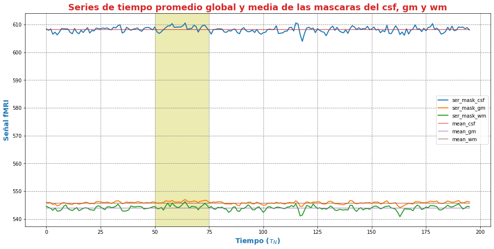
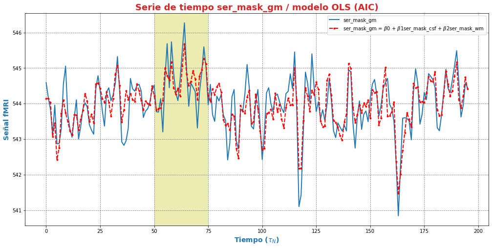
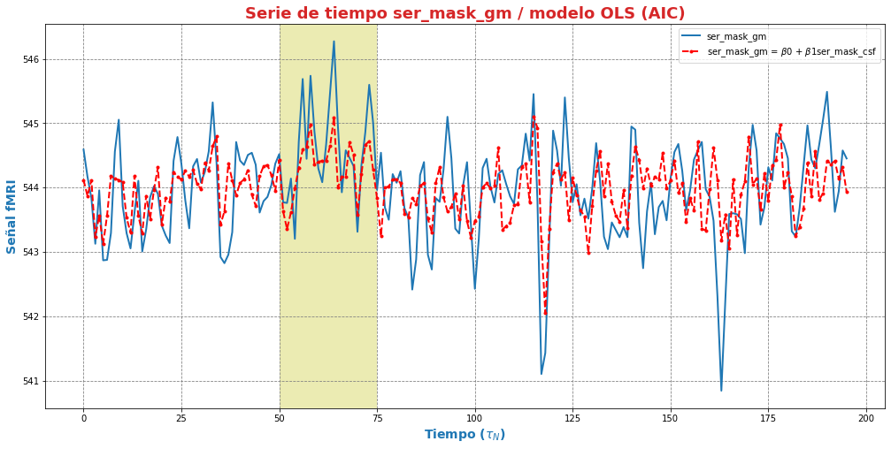
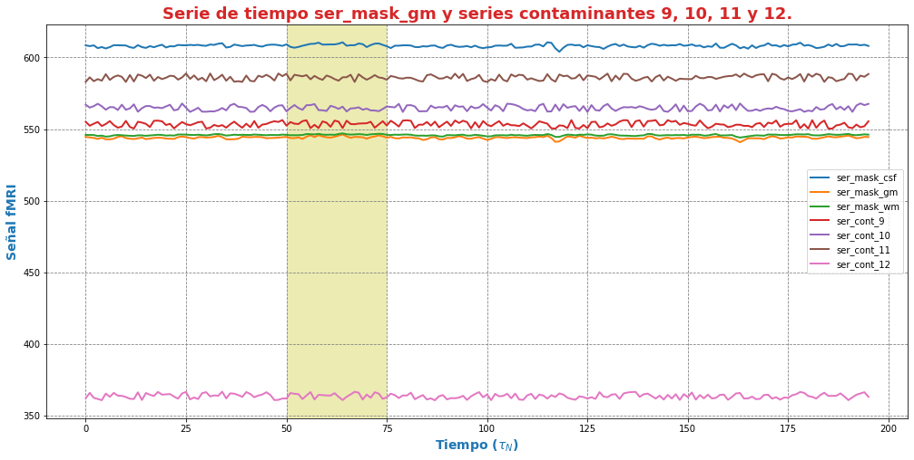
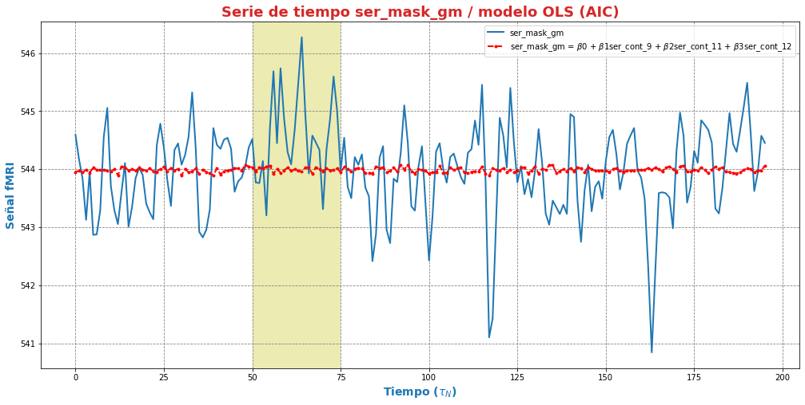

---

---

***Andres Eduardo Aracena Rangel***

*Estudiante del programa del Magister en Física Médica*

---

---


El siguiente Script de Python forma parte del trabajo especial de grado.

Profesora Guía:

*PhD María Daniela Cornejo*

---

---

&nbsp;
Con referencia:

- [Pagina oficial NIbabel](https://nipy.org/nibabel/index.html) 

Imagenes de fMRI extraidas de OpenNuero:
 
 - [ds002422](https://openneuro.org/datasets/ds002422/versions/1.1.0)
 
---

---

 Acronimos:

- CSF: Cerebrospinal Fluid (*líquido cefalorraquídeo*)
- GM: Gray Matter (*materia gris*)
- WM: White Matter (*materia blanca*)

---

---

NOTA:
Cuando indiquemos imagenes brain o mascaras brain, nos estamos refieriendo a las imagenes o mascaras de csf, wm, gm

---

---

# Modelos de regresión lineal múltiple en series del tejido cerebral

## Importamos librerias


```python
import time # medir el tiempo de ejecución de nuestros programas
start = time.process_time()
inicio = time.time()
```


```python
import os # El módulo os nos permite acceder a funcionalidades dependientes del Sistema Operativo
from os.path import join as opj   # Este método concatena varios componentes de ruta con exactamente un separador de directorio(‘/’)
import matplotlib.pyplot as plt   # Permite la generación de gráficos
import pandas as pd               #Biblioteca para manipulación de marcos de datos
import numpy as np
from numpy import random

#Biblioteca para estimar modelos estadísticos y realizar pruebas estadísticas
import statsmodels.api as sm
```

## Definimos parámetros


```python
'''
Ruta donde reposan las series promedios 'brain' y 'series aleatorias' en archivo csv
'''
path_series = '/home/aracena/thesis_ds002422/04_fase2_promedio_series_tiempo_brain/output/0.95/archivos_csv/' 

'''
Ruta donde se guardaran resultados
'''
path_exp = '/home/aracena/thesis_ds002422/06_fase3_validacion_aic_regre_lin_ser_brain/'
path_out = opj(path_exp, 'output')
path_png = opj(path_out, 'archivos_png')

'''
Creamos la carpeta de salida
'''
os.system('mkdir -p %s'%path_out);
os.system('mkdir -p %s'%path_png);
```

## Funciones

### Función para graficar series de tiempo


```python
'''
Función grafica las series de tiempo de una DF introducida. Se requiere input:

- df_data = Dataframe que contiene las series de tiempo
- name_save = nombre con que desea guardar el grafico
'''

def plot_series_time(df_data, resaltar, titulo, name_save): 
    # Creamos una lista con las claves del diccionario ingresado
    tejido = list(df_data.keys())
    # definimos una ventana
    vent_min = 50
    vent_max = 75


    font1 = {'fontsize':14, 'fontweight':'bold', 'color':'tab:blue'}
    font2  = {'fontsize':18, 'fontweight':'bold', 'color':'tab:red'}

    fig, ax = plt.subplots(figsize = (17,8))
    for i,tisue in enumerate(tejido):
        if resaltar[0] == 'all':
            ax.plot(df_data[tisue], linewidth=2, label=tisue)
        elif i < len(resaltar):
            ax.plot(df_data[resaltar[i]], linewidth=2, label=tisue)
        else:           
            ax.plot(df_data[tisue], linewidth=1, label=tisue)

    ax.legend()
    ax.set_xlabel('Tiempo ($\\tau_N$)',fontdict=font1)
    ax.set_ylabel('Señal fMRI',fontdict=font1)
    ax.set_title(titulo, fontdict = font2)
    ax.grid(axis = 'x', color = 'gray', linestyle = 'dashed')
    ax.grid(axis = 'y', color = 'gray', linestyle = 'dashed')
    ax.axvspan(vent_min,vent_max, alpha=0.3, facecolor='y')

    plt.savefig(opj(path_png, name_save))
```

### Función crear lista de las series de un DF (lista de los valores de la columna del DF) y eliminar series


```python
'''
Función  que extrae una lista de los valores de las columnas de un dataframe.

Inputs:

- df: Dataframe que se desea extrae una lista de los valores de las columnas,
- elmiminar: lista de los valores de las columnas del DF que desea eliminar. Se debe ingresar una lista:
        * NO eliminar ningun valor de las columnas DF --> ['none']
        * Elimimnar uno o mas valores de la lista --> ['nombre_1' , 'nombre_2']
        
        LOS VALORES DEBE ESTAR EN FORMATO STRING (entre comillas simples o dobles)

Output:

- list_series: lista de series del DF
'''

def lista_dataframe(df, eliminar):
    # Creamos una lista de las columnas del dataframe
    series = df.columns.values
    list_series = list(series)
    
    tam = len(eliminar)

    if tam == 1:
        if eliminar[0] == 'none':
            list_series
        else:
            list_series.remove(eliminar[0]) 
    if tam != 1:   
        for i in range(tam):
            list_series.remove(eliminar[i])        
    
    return list_series    
```

### Función de conjunto potencia ó de número de combinaciones

En matemáticas, dado un conjunto $S$, se llama conjunto potencia o conjunto de partes de $S$ (se denota por $P(S)$ o $2^S$) al conjunto formado por todos los subconjuntos posibles de $S$.

Por ejemplo, si $S= {a, b, c}$ entonces el conjunto potencia de $S$ es 

*P(S) = {{ }, {a}, {b}, {c}, {a, b}, {a, c}, {b, c}, {a, b, c} }*


```python
'''
Función para extraer todos los subconjuntos posibles de un conjunto de una lista de entrada.

Inputs:

- lista_conjunto: Lista donde se desea extraer el conjunto potencia
- columnas: Numero de columnas para ordenar las combinaciones/modelos

Output:

- r: Lista de las combinaciones/modelos.
'''

def potencia(list_conjunto):
    '''
    Calcula y devuelve el conjunto potencia del conjunto c.
    En matemáticas, el conjunto potencia de un conjunto dado es otro conjunto 
    formado por todos los subconjuntos del conjunto dado.
    '''
   
    # Número de combinaciones
    if len(list_conjunto) == 0:
        return [[]]
    r = potencia(list_conjunto[:-1])
    
    return r + [s + [list_conjunto[-1]] for s in r]
```

### Funcion para crear un dataframe de las combinaciones/modelos


```python
'''
Función para visualizar las combinaciones/modelos en un dataframe, para ser incorporada en documentos.

Inputs:

- lista_combi: Lista de combinaciones/modelos 
- columnas: Numero de columnas para ordenar las combinaciones/modelos

Output:

- df_combi: Dataframe con las combinaciones/modelos
'''


def crear_df_combi(lista_combi, columnas):
    combi = lista_combi
    '''
    ordenamos la lista
    '''
    combi.sort()
    
    '''
    Se reescribe el elemento lista de la lista en un solo valor, 
    que es la combinacion/modelo
    '''

    list_combi =[]
    beta = str('$\\beta$')
    for i, co in enumerate(combi):
        modelo= beta+str(0)
        for j, mo in enumerate(combi[i]):
            modelo = modelo + ' + ' + beta + str(j+1) + ' ' + mo
        list_combi.append(modelo)   
    
    '''
    PROCESO DE CONVERTIR DE LISTA 1D A UN DATAFRAME FIL X COLUM
    '''
    # Indique cuantas columnas quiere representar las combinaciones en un DF
    colum = columnas

    # Como se quiere crear una matriz de 'colum' columnas, 
    # verifico si 'long' es divisible entre 'colum'; de no ser serlo, 
    # agrego un elemneto vacio a la lista hasta conseguirlo
    long = len(list_combi)
    n=0
    while n==0:
        if long % colum == 0: 
            n=1
        else:
            list_combi.append('')
            long = len(list_combi)
            
    # Conviertimos la lista en un array
    co = np.array(list_combi)

    # Conviertimos un array de 1D a laa dimension fil x colum
    fil = int(long/colum) # numero de filas

    co = co.reshape(fil,colum)

    # Convertirmos la matriz fil x colum en un DF
    df_combi = pd.DataFrame(co)

    '''
    Cambiamos nombre de columnas
    '''
    #Creamos lista de nuevos nombres
    new_colum = []
    for i in range(colum):
        new_colum.append('Combinaciones / Modelos')

    df_combi.columns = new_colum

    '''
    Renombramos indice
    '''
    #Creamos diccionario de nuevos indices
    new_index = {}
    for i in range(fil):
        new_index[i]= ' '

    #renombramos indices
    df_combi.rename(index=new_index, inplace=True)
    
    return df_combi    
```


```python
'''
Función para visualizar las combinaciones/modelos en un dataframe, para ser incorporada en documentos.

Inputs:

- lista_combi: Lista de combinaciones/modelos 
- columnas: Numero de columnas para ordenar las combinaciones/modelos

Output:

- df_combi: Dataframe con las combinaciones/modelos
'''


def crear_df_combi_1(lista_combi, columnas):
    '''
    ordenamos la lista
    '''
    combi.sort()
    
    '''
    Se reescribe el elemento lista de la lista en un solo valor, 
    que es la combinacion/modelo
    '''
    le = len(combi)
    list_combi =[]
    for i, co in enumerate(combi):
        ser = co
        w = len(ser)
        for i, se in enumerate(ser):
            if i == 0:
                agr = se
            else:
                agr = agr + ' + ' + se
        list_combi.append(agr)
        
    '''
    PROCESO DE CONVERTIR DE LISTA 1D A UN DATAFRAME FIL X COLUM
    '''
    # Indique cuantas columnas quiere representar las combinaciones en un DF
    colum = columnas

    # Como se quiere crear una matriz de 'colum' columnas, 
    # verifico si 'long' es divisible entre 'colum'; de no ser serlo, 
    # agrego un elemneto vacio a la lista hasta conseguirlo
    long = len(list_combi)
    n=0
    while n==0:
        if long % colum == 0: 
            n=1
        else:
            list_combi.append('')
            long = len(list_combi)
            
    # Conviertimos la lista en un array
    co = np.array(list_combi)

    # Conviertimos un array de 1D a laa dimension fil x colum
    fil = int(long/colum) # numero de filas

    co = co.reshape(fil,colum)

    # Convertirmos la matriz fil x colum en un DF
    df_combi = pd.DataFrame(co)

    '''
    Cambiamos nombre de columnas
    '''
    #Creamos lista de nuevos nombres
    new_colum = []
    for i in range(colum):
        new_colum.append('Combinaciones / Modelos')

    df_combi.columns = new_colum

    '''
    Renombramos indice
    '''
    #Creamos diccionario de nuevos indices
    new_index = {}
    for i in range(fil):
        new_index[i]= ' '

    #renombramos indices
    df_combi.rename(index=new_index, inplace=True)
    
    return df_combi    
```

### Función aplicacion modelo OLS


```python
'''
df_analisis: Dataframe que contien la serie dependiente (variable dependiente o variable de respuesta)
                y las series predictoras (ariables independientes o variables predictoras)
var_depen: Variable dependiente del dataframe (serie a predecir)
modelo: modelo a predecir la variable dependiente

Output: 

aic, r2, r2_adj, model: estadistios
'''


def estadisticos(df_analisis, var_depen, modelo):
    # Y: normalmente significa la variable respuesta (variable dependiente o variable de respuesta)
    #define response variable
    Y = df_analisis[var_depen]

    # X: usualmente significa nuestras variables de entrada (variables independientes o variables predictoras)
    X = df_analisis[modelo]

    #agregar constante a las variables predictoras [intercepción (beta_0) al modelo]
    X = sm.add_constant(X)

    #ajustamos modelo de regresión
    model = sm.OLS(Y, X).fit()    # sm.OLS(respuesta, entrada)

    #guardamos estadisticos AIC, R2, R2-AJUSTADO
    aic = model.aic
    r2 = model.rsquared
    r2_adj = model.rsquared_adj
    
    return aic, r2, r2_adj, model
```

### Función para determinar el mejor modelo mediante modelo de regresión OSL


```python
def best_osl(df_depen, df_indep, var_depen, lista_combi):
    num_ser = df_depen.shape[1]

    a = pd.DataFrame()
    b = pd.DataFrame()
    aa = pd.DataFrame()
    bb = pd.DataFrame()
    aaa = pd.DataFrame()
    bbb = pd.DataFrame()
    for i in range(num_ser):
        #creamos una lista que identifica la serie del voxel, con la camtidad de combinaciones
        serie = []
        for j in enumerate(lista_combi):
            serie.append(i)
        #se crea dataframe que identifica voxel en estudio
        df_serie = pd.DataFrame(serie, columns=['serie'])

        #extraemos la serie de tiempo del voxel i
        serie_estudio = df_depen.iloc[:,[i]]
        serie_estudio.columns=[var_depen]

        analisis = pd.merge(serie_estudio, df_indep,
                               right_index=True,left_index=True)

        #Ejecutamos la funcion aic
        RESULTADO_AIC = {}
        RESULTADO_R2 = {}
        RESULTADO_R2_AJU = {}
        modelo = {}
        for i, c in enumerate(lista_combi):
            li = lista_combi[i]
            anali = estadisticos(df_analisis=analisis,
                                 var_depen= var_depen,
                                 modelo=li)
            AIC = round(anali[0],2)
            R2 = round(anali[1],4)
            R2_AJU = round(anali[2],4)        
            c = ','.join(c)
            RESULTADO_AIC[c] = AIC
            RESULTADO_R2[c] = R2
            RESULTADO_R2_AJU[c] = R2_AJU
            modelo[c] = anali[3]


        '''
        DataFrame AIC
        '''
        #representamos el resultado aic en un dataframe
        DF_AIC = pd.DataFrame(list(RESULTADO_AIC.items()),
                       columns=['MODELO', 'AIC'])

        #representamos el resultado del modelo(resultado de la regresión
        # lineal) en un dataframe
        DF_MODELO = pd.DataFrame(list(modelo.items()),
                       columns=['MODELO', 'resultado_regresión'])

        # Unimos DF de resultado aic con DF modelo
        DF_AIC = pd.merge(DF_AIC,DF_MODELO, on='MODELO')

        #ordenamos de mayor a menor
        DFM_AIC = DF_AIC.sort_values('AIC')

        #restablecer el índice (para poder eliminar luego los dos ultimos)
        DFM_AIC.reset_index(drop=True, inplace=True)

        #unimos DFM con la identificacion del voxel
        best_model_aic = pd.merge(df_serie, DFM_AIC,
                           right_index=True,left_index=True)

        #elegimos el mejor modelo del voxel en estudio
        be = 1
        en =  len(lista_combi)
        best_aic = best_model_aic.drop(range(1, en, 1),axis=0)

        if i == 0:
            # creamos a y b para concatenar los demas resultados
            a = best_model_aic
            b = best_aic
        else:
            best_model_aic = pd.concat([a, best_model_aic])
            best_aic = pd.concat([b, best_aic])
            a = best_model_aic
            b = best_aic

        #restablecer el índice
        best_model_aic.reset_index(drop=True, inplace=True)
        best_aic.reset_index(drop=True, inplace=True)


        '''
        DataFrame R2
        '''

        #representamos el resultado aic en un dataframe
        DF_R2 = pd.DataFrame(list(RESULTADO_R2.items()),
                       columns=['MODELO', 'R2'])
        #representamos el resultado del modelo(resultado de la regresión
        # lineal) en un dataframe
        DF_MODELO_R2 = pd.DataFrame(list(modelo.items()),
                       columns=['MODELO', 'resultado_regresión'])

        # Unimos DF de resultado aic con DF modelo
        DF_R2 = pd.merge(DF_R2,DF_MODELO_R2, on='MODELO')


        #ordenamos de mayor a menor
        DFM_R2 = DF_R2.sort_values('R2',ascending=False)

        #restablecer el índice (para poder eliminar luego los dos ultimos)
        DFM_R2.reset_index(drop=True, inplace=True)

        #unimos DFM con la identificacion del voxel
        best_model_r2 = pd.merge(df_serie, DFM_R2,
                           right_index=True,left_index=True)

        #elegimos el mejor modelo del voxel en estudio
        be = 1
        en =  len(lista_combi)
        best_r2 = best_model_r2.drop(range(1, en, 1),axis=0)

        if i == 0:
            # creamos a y b para concatenar los demas resultados
            aa = best_model_r2
            bb = best_r2
        else:
            best_model_r2 = pd.concat([aa, best_model_r2])
            best_r2 = pd.concat([bb, best_r2])
            aa = best_model_r2
            bb = best_r2

        #restablecer el índice
        best_model_r2.reset_index(drop=True, inplace=True)
        best_r2.reset_index(drop=True, inplace=True)


        '''
        DataFrame R2-ajustado
        '''
        #representamos el resultado aic en un dataframe
        DF_R2_AJU = pd.DataFrame(list(RESULTADO_R2_AJU.items()),
                       columns=['MODELO', 'R2-ajus'])

        #representamos el resultado del modelo(resultado de la regresión
        # lineal) en un dataframe
        DF_MODELO_R2_AJU = pd.DataFrame(list(modelo.items()),
                       columns=['MODELO', 'resultado_regresión'])

        # Unimos DF de resultado aic con DF modelo
        DF_R2_AJU= pd.merge(DF_R2_AJU,DF_MODELO_R2_AJU, on='MODELO')

        #ordenamos de mayor a menor
        DFM_R2_AJU = DF_R2_AJU.sort_values('R2-ajus',ascending=False)

        #restablecer el índice (para poder eliminar luego los dos ultimos)
        DFM_R2_AJU.reset_index(drop=True, inplace=True)

        #unimos DFM con la identificacion del voxel
        best_model_aju = pd.merge(df_serie, DFM_R2_AJU,
                           right_index=True,left_index=True)

        #elegimos el mejor modelo del voxel en estudio
        be = 1
        en =  len(lista_combi)
        best_r2_aju = best_model_aju.drop(range(1, en, 1),axis=0)

        if i == 0:
            # creamos a y b para concatenar los demas resultados
            aaa = best_model_aju
            bbb = best_r2_aju
        else:
            best_model_aju = pd.concat([aaa, best_model_aju])
            best_r2_aju = pd.concat([bbb, best_r2_aju])
            aaa = best_model_aju
            bbb = best_r2_aju

        #restablecer el índice
        best_model_aju.reset_index(drop=True, inplace=True)
        best_r2_aju.reset_index(drop=True, inplace=True)

    return  best_aic, best_model_aic, best_r2, best_model_r2, best_r2_aju, best_model_aju, 
    #print(DFM_R2)
    #print('\n',best_model)
    #print('\n', best_aic)
```

### Función para extraer los valores p de los regresores


```python
'''
Función para extraer los valores p de las variables regresoras y su analisis con respecto al nivel 
significancia. Se requiere como inputs:

- df_ana = DF que se desea analisar y que debe contener los resultados de la regresión lineal
- nivel_signif = Nivel de significancia, si es de 5%, ingresamos 0.05, 
                                         si es del 10%, ingresamos 0.1, etc

Como output obtendremos un DF con el analisis sobre el valor p en los regresores
'''


def analisi_p(df_anali, nivel_signif):
    import pandas as pd
    '''
    Extraemos el primer indice de la DF a analizar. Esto se realiza, ya que en el analisis podremos escojer 
    los mejores aic de un conjunto de series que no empiece en el voxel/serie cero, por ejemplo, 
    puedo escojer los voxels del valor 4865 al 9728 que corresponden al segundo corte, y si utilizamos 
    el ciclo for desde 0, nos cambiara la identificación del voxel para para ser ingresado a la DF; 
    por ejemplo, el primer voxel al pasar por el ciclo es el 4865, y el ciclo lo guaradara 
    como 0
    '''

    inicio = df_anali.index.start

    '''
    Extraemos los valores p
    '''
    tam = len(df_anali)

    df_coef = pd.DataFrame()
    df_suma = pd.DataFrame()
    for i in range(tam):
        #extraemos resultados de la regresión lineal (RL) de las series de la imagen
        best_model = df_anali['resultado_regresión'][i+inicio]     
        indice = inicio + i
        #creamos DF de los valores p de la RL de la serie
        df_co = pd.DataFrame(round(best_model.pvalues,2)).T
        df_co.index = [indice]    

        #concatenamos
        df_coef = pd.concat([df_coef,df_co])

        #extraemos nombre de las columnas (regresores) en una lista; se extraee de la lista antes de concaenar
        regresores = df_co.columns.values  
        list_regresor = list(regresores)

        suma_evaluacion = 0
        valores_p = [] # creamos una lista para guardar los valores p y luego anexarla al DF best_aic

        for i, re in enumerate(list_regresor):
            coef = df_coef[re][indice]
            if coef < nivel_signif:
                suma_evaluacion = suma_evaluacion
            else:
                suma_evaluacion = suma_evaluacion + 1

            valores_p.append(coef)

        '''
        Agregamos el resultado de la lista de valores p de los regresores y 
        la suma_evaluación al DF en evaluación
        '''
        df_su = pd.DataFrame()
        df_su['valores_p_regresores'] = [valores_p]
        df_su['suma_evaluación'] = [suma_evaluacion]
        df_su.index = [indice]

        # concatenamos
        df_suma = pd.concat([df_suma,df_su])

    '''
    Unimos en un DF el resultado final
    '''
    analisis_p = pd.merge(df_coef, df_suma,
                       right_index=True,left_index=True)
    '''
    Unimos con la DF analisi_p con la DF de entrada
    '''
    best_p_1 = pd.merge(df_anali, analisis_p,
                           right_index=True,left_index=True)

    # eliminamos la columna resultado_regresión, 
    best_p = best_p_1.drop(['resultado_regresión'], axis=1)
    
    '''
    Crearemos un DF donde anexaremos una nueva columna, donde al evaluar suma_evaluacion si es 0, 
    agregamos el modelo AIC, si es mayor a cero, agregamos la palabra 'Pout', indicandonos que el
    modelo iene un valor p matyor a 0.05
    '''
    modelo_p = pd.DataFrame()

    for i in range(tam):
        valeva = best_p['suma_evaluación'][i+inicio]

        model_p = pd.DataFrame()
        if valeva == 0:
            model_p['MODELO_P'] = [best_p['MODELO'][i+inicio]]
        else:
            model_p['MODELO_P'] = ['Pout']

        model_p.index = [i+inicio]
        modelo_p = pd.concat([modelo_p,model_p])
    '''
    UNIMOS DF
    '''
    df_anali_p = pd.merge(best_p, modelo_p,
                     right_index=True,left_index=True)
    
    return df_anali_p
```


```python
'''
Función para extraer los valores p de las variables regresoras y su analisis con respecto al nivel 
significancia. Se requiere como inputs:

- df_ana = DF que se desea analisar y que debe contener los resultados de la regresión lineal
- nivel_signif = Nivel de significancia, si es de 5%, ingresamos 0.05, 
                                         si es del 10%, ingresamos 0.1, etc

Como output obtendremos un DF con el analisis sobre el valor p en los regresores
'''


def analisi_p_1(df_anali, nivel_signif):
    import pandas as pd
    '''
    Extraemos el primer indice de la DF a analizar. Esto se realiza, ya que en el analisis podremos escojer 
    los mejores aic de un conjunto de series que no empiece en el voxel/serie cero, por ejemplo, 
    puedo escojer los voxels del valor 4865 al 9728 que corresponden al segundo corte, y si utilizamos 
    el ciclo for desde 0, nos cambiara la identificación del voxel para para ser ingresado a la DF; 
    por ejemplo, el primer voxel al pasar por el ciclo es el 4865, y el ciclo lo guaradara 
    como 0
    '''

    inicio = df_anali.index.start

    '''
    Extraemos los valores p
    '''
    tam = len(df_anali)

    df_coef = pd.DataFrame()
    df_suma = pd.DataFrame()
    for i in range(tam):
        #extraemos resultados de la regresión lineal (RL) de las series de la imagen
        best_model = df_anali['resultado_regresión'][i+inicio]     
        indice = inicio + i
        #creamos DF de los valores p de la RL de la serie
        df_co = pd.DataFrame(round(best_model.pvalues,2)).T
        df_co.index = [indice]   

        #concatenamos
        df_coef = pd.concat([df_coef,df_co])

        #extraemos nombre de las columnas (regresores) en una lista; se extrae de la lista antes de concaenar
        regresores = df_co.columns.values  
        list_regresor = list(regresores)

        suma_evaluacion = 0
        valores_p = [] # creamos una lista para guardar los valores p y luego anexarla al DF best_aic
        
        # El la evaluación, no tomamos en cuenta el valor p de la constante
        for i in range(len(list_regresor)-1):            
            coef = df_coef[list_regresor[i+1]][indice]
            if coef < nivel_signif:
                suma_evaluacion = suma_evaluacion
            else:
                suma_evaluacion = suma_evaluacion + 1

            valores_p.append(coef)

        '''
        Agregamos el resultado de la lista de valores p de los regresores y 
        la suma_evaluación al DF en evaluación
        '''
        df_su = pd.DataFrame()
        df_su['valores_p_regresores_ser'] = [valores_p]
        df_su['suma_evaluación'] = [suma_evaluacion]
        df_su.index = [indice]

        # concatenamos
        df_suma = pd.concat([df_suma,df_su])

    '''
    Unimos en un DF el resultado final
    '''
    analisis_p = pd.merge(df_coef, df_suma,
                       right_index=True,left_index=True)
    '''
    Unimos con la DF analisi_p con la DF de entrada
    '''
    best_p_1 = pd.merge(df_anali, analisis_p,
                           right_index=True,left_index=True)

    # eliminamos la columna resultado_regresión, 
    best_p = best_p_1.drop(['resultado_regresión'], axis=1)
    
    '''
    Crearemos un DF donde anexaremos una nueva columna, donde al evaluar suma_evaluacion si es 0, 
    agregamos el modelo AIC, si es mayor a cero, agregamos la palabra 'Pout', indicandonos que el
    modelo iene un valor p matyor a 0.05
    '''
    modelo_p = pd.DataFrame()

    for i in range(tam):
        valeva = best_p['suma_evaluación'][i+inicio]

        model_p = pd.DataFrame()
        if valeva == 0:
            model_p['MODELO_P'] = [best_p['MODELO'][i+inicio]]
        else:
            model_p['MODELO_P'] = ['Pout']

        model_p.index = [i+inicio]
        modelo_p = pd.concat([modelo_p,model_p])
    '''
    UNIMOS DF
    '''
    df_anali_p = pd.merge(best_p, modelo_p,
                     right_index=True,left_index=True)
    
    return df_anali_p
```

### Función para graficar la variable dependiente en un modelo de OSL y el resultado del mejor modelo


```python
'''
Función para graficar la variable dependiente en un modelo de OSL y el resultado del mejor modelo 
mediante modelo de regresión OSL.

Inputs:

- df_depen = Dataframe de la variable dependiente del modelo de OSL 
- models_osl = Dataframe de los modelos de regresion al aplicar la funcion 'best_osl'. Ingresar solo
                el resultado segun alguno de los estadistico de AIC, R2 o R2_adjustado.
- best = seleccionar el modelo que quiere graficar. Si desea graficar el mejor modelo, se ingresa 0; 
        si desea graficar el segundo mejor modelo, se ingresa 1, y asi sucesivamente.
- titulo = titulo de la grafica
- name_save = nombre con el que se desea guardar la grafica
'''

def plot_series_osl(df_depen, models_osl, best, titulo, name_save): 
    '''
    Elegimos el modelo segun variable input best
    '''
    best_model= models_osl['resultado_regresión'][best]
    print(best_model.summary())
    
    '''
    Crear la etiqueta del mejor modelo
    '''

    for i, mo in enumerate(models_osl['MODELO'][best]):
        mo=models_osl['MODELO'][best].split(',') #Split regresa una lista de las palabras en la cadena, 
                                 # usando separador como el delimitador.

    '''
    Creamos nombre con los coeficientes y series del mejor modelo
    '''
    beta = str('$\\beta$')
    modelo_win = df_depen.columns.values[0]+' = '+beta+str(0)
    for i, m in enumerate(mo):
        modelo_win = modelo_win + ' + ' + beta + str(i+1) + m 
    
    '''
    Creamos etiqueta de la variable dependiente
    '''
    label_depen = df_depen.columns.values
    label_depen = label_depen[0]
    
    '''
    Dataframe del modelo de regresion OSL
    '''
    df_osl = pd.DataFrame(best_model.fittedvalues)
    df_osl.columns = ['modelo OLS']    
    
    # definimos una ventana
    vent_min = 50
    vent_max = 75


    font1 = {'fontsize':14, 'fontweight':'bold', 'color':'tab:blue'}
    font2  = {'fontsize':18, 'fontweight':'bold', 'color':'tab:red'}

    fig, ax = plt.subplots(figsize = (17,8))
    ax.plot(df_depen, linewidth=2, label=label_depen)
    ax.plot(df_osl, '--.', linewidth=2, color = 'red', label=modelo_win)

    ax.legend()
    ax.set_xlabel('Tiempo ($\\tau_N$)',fontdict=font1)
    ax.set_ylabel('Señal fMRI',fontdict=font1)
    ax.set_title(titulo, fontdict = font2)
    ax.grid(axis = 'x', color = 'gray', linestyle = 'dashed')
    ax.grid(axis = 'y', color = 'gray', linestyle = 'dashed')
    ax.axvspan(vent_min,vent_max, alpha=0.3, facecolor='y')

    plt.savefig(opj(path_png, name_save))
```

### Función para comparar los modelos segun los estadisticos AIC, R2 Y R2 ajustado


```python
'''
Función que genera un dataframe de comparacion de los modelos segun los estadisticos AIC, R2 Y R2 ajustado.

Inputs:

aic = DF modelos segun el estadistico AIC (DF resultante de la funcion 'best_osl')
r2 = DF modelos segun el estadistico R2 (DF resultante de la funcion 'best_osl')
r2_ajus = DF modelos segun el estadistico R2_ajus (DF resultante de la funcion 'best_osl')
'''

def compara_models_estad(aic,r2,r2_ajus):
    df_aic_best = aic_all.copy()
    df_aic_best = df_aic_best.drop(['serie', 'resultado_regresión'], axis=1)
    
    df_r2_best = r2_all.copy()
    df_r2_best = df_r2_best.drop(['serie', 'resultado_regresión'], axis=1)
    
    df_r2_aju_best = r2_ajus_all.copy()
    df_r2_aju_best = df_r2_aju_best.drop(['serie', 'resultado_regresión'], axis=1)
    
    df4 = pd.merge(df_aic_best,df_r2_best,on='MODELO',how='left')
    df5 = pd.merge(df4,df_r2_aju_best,on='MODELO',how='left')

    df5.style.highlight_max(axis=0)
    
    return     df5.style.\
                    highlight_max(subset=['AIC'], color='salmon').\
                    highlight_min(subset=['AIC'], color='yellow').\
                    highlight_max(subset=['R2','R2-ajus'], color='yellow').\
                    highlight_min(subset=['R2','R2-ajus'], color='salmon').\
                    format({'id':'{:.0f}'})
    
```

## Cargamos las series promedio global CSF, GM y WM.


```python
'''
Cargamos la serie del csf
'''
df_csf = pd.read_csv (opj(path_series,'serie_tiempo_val_prom_ser_mask_csf.csv'))

'''
Cargamos la serie del gm
'''
df_gm = pd.read_csv (opj(path_series,'serie_tiempo_val_prom_ser_mask_gm.csv'))


'''
Cargamos la serie del wm
'''
df_wm = pd.read_csv (opj(path_series,'serie_tiempo_val_prom_ser_mask_wm.csv'))

'''
Unimos series csf, gm y wm en un dataframe
'''
df_series_brain = pd.merge(df_csf,df_gm,right_index=True,left_index=True)
df_series_brain = pd.merge(df_series_brain,df_wm,right_index=True,left_index=True)

df_series_brain.round(3)
```


<div>
<style scoped>
    .dataframe tbody tr th:only-of-type {
        vertical-align: middle;
    }

    .dataframe tbody tr th {
        vertical-align: top;
    }

    .dataframe thead th {
        text-align: right;
    }
</style>
<table border="1" class="dataframe">
  <thead>
    <tr style="text-align: right;">
      <th></th>
      <th>ser_mask_csf</th>
      <th>ser_mask_gm</th>
      <th>ser_mask_wm</th>
    </tr>
  </thead>
  <tbody>
    <tr>
      <th>0</th>
      <td>608.446</td>
      <td>544.591</td>
      <td>545.955</td>
    </tr>
    <tr>
      <th>1</th>
      <td>607.910</td>
      <td>544.170</td>
      <td>545.948</td>
    </tr>
    <tr>
      <th>2</th>
      <td>608.437</td>
      <td>543.839</td>
      <td>545.871</td>
    </tr>
    <tr>
      <th>3</th>
      <td>606.512</td>
      <td>543.127</td>
      <td>545.200</td>
    </tr>
    <tr>
      <th>4</th>
      <td>607.254</td>
      <td>543.957</td>
      <td>545.471</td>
    </tr>
    <tr>
      <th>...</th>
      <td>...</td>
      <td>...</td>
      <td>...</td>
    </tr>
    <tr>
      <th>191</th>
      <td>608.981</td>
      <td>544.611</td>
      <td>545.935</td>
    </tr>
    <tr>
      <th>192</th>
      <td>609.086</td>
      <td>543.623</td>
      <td>545.773</td>
    </tr>
    <tr>
      <th>193</th>
      <td>608.485</td>
      <td>543.943</td>
      <td>545.999</td>
    </tr>
    <tr>
      <th>194</th>
      <td>608.888</td>
      <td>544.576</td>
      <td>546.369</td>
    </tr>
    <tr>
      <th>195</th>
      <td>608.049</td>
      <td>544.453</td>
      <td>546.134</td>
    </tr>
  </tbody>
</table>
<p>196 rows × 3 columns</p>
</div>


### Extraemos la media de las series  *brain* 


```python
df_mean = pd.DataFrame(df_series_brain.mean())
df_mean.columns = ['mean']
df_mean.round(3)
```


<div>
<style scoped>
    .dataframe tbody tr th:only-of-type {
        vertical-align: middle;
    }

    .dataframe tbody tr th {
        vertical-align: top;
    }

    .dataframe thead th {
        text-align: right;
    }
</style>
<table border="1" class="dataframe">
  <thead>
    <tr style="text-align: right;">
      <th></th>
      <th>mean</th>
    </tr>
  </thead>
  <tbody>
    <tr>
      <th>ser_mask_csf</th>
      <td>608.159</td>
    </tr>
    <tr>
      <th>ser_mask_gm</th>
      <td>543.987</td>
    </tr>
    <tr>
      <th>ser_mask_wm</th>
      <td>545.843</td>
    </tr>
  </tbody>
</table>
</div>


### Creamos dataframe para graficar las series brain con la media


```python
df_mean_csf = pd.DataFrame()
```


```python
df_mean_csf = pd.DataFrame(columns = ['mean_csf'])

for i in range(df_series_brain['ser_mask_csf'].shape[0]):
    df_mean_csf = df_mean_csf.append({'mean_csf':df_mean['mean']['ser_mask_csf']},                
                   ignore_index = True) 
df_mean_csf
```


<div>
<style scoped>
    .dataframe tbody tr th:only-of-type {
        vertical-align: middle;
    }

    .dataframe tbody tr th {
        vertical-align: top;
    }

    .dataframe thead th {
        text-align: right;
    }
</style>
<table border="1" class="dataframe">
  <thead>
    <tr style="text-align: right;">
      <th></th>
      <th>mean_csf</th>
    </tr>
  </thead>
  <tbody>
    <tr>
      <th>0</th>
      <td>608.159373</td>
    </tr>
    <tr>
      <th>1</th>
      <td>608.159373</td>
    </tr>
    <tr>
      <th>2</th>
      <td>608.159373</td>
    </tr>
    <tr>
      <th>3</th>
      <td>608.159373</td>
    </tr>
    <tr>
      <th>4</th>
      <td>608.159373</td>
    </tr>
    <tr>
      <th>...</th>
      <td>...</td>
    </tr>
    <tr>
      <th>191</th>
      <td>608.159373</td>
    </tr>
    <tr>
      <th>192</th>
      <td>608.159373</td>
    </tr>
    <tr>
      <th>193</th>
      <td>608.159373</td>
    </tr>
    <tr>
      <th>194</th>
      <td>608.159373</td>
    </tr>
    <tr>
      <th>195</th>
      <td>608.159373</td>
    </tr>
  </tbody>
</table>
<p>196 rows × 1 columns</p>
</div>


```python
df_mean_gm = pd.DataFrame(columns = ['mean_gm'])

for i in range(df_series_brain['ser_mask_gm'].shape[0]):
    df_mean_gm = df_mean_gm.append({'mean_gm':df_mean['mean']['ser_mask_gm']},                
                   ignore_index = True) 
df_mean_gm
```


<div>
<style scoped>
    .dataframe tbody tr th:only-of-type {
        vertical-align: middle;
    }

    .dataframe tbody tr th {
        vertical-align: top;
    }

    .dataframe thead th {
        text-align: right;
    }
</style>
<table border="1" class="dataframe">
  <thead>
    <tr style="text-align: right;">
      <th></th>
      <th>mean_gm</th>
    </tr>
  </thead>
  <tbody>
    <tr>
      <th>0</th>
      <td>543.986571</td>
    </tr>
    <tr>
      <th>1</th>
      <td>543.986571</td>
    </tr>
    <tr>
      <th>2</th>
      <td>543.986571</td>
    </tr>
    <tr>
      <th>3</th>
      <td>543.986571</td>
    </tr>
    <tr>
      <th>4</th>
      <td>543.986571</td>
    </tr>
    <tr>
      <th>...</th>
      <td>...</td>
    </tr>
    <tr>
      <th>191</th>
      <td>543.986571</td>
    </tr>
    <tr>
      <th>192</th>
      <td>543.986571</td>
    </tr>
    <tr>
      <th>193</th>
      <td>543.986571</td>
    </tr>
    <tr>
      <th>194</th>
      <td>543.986571</td>
    </tr>
    <tr>
      <th>195</th>
      <td>543.986571</td>
    </tr>
  </tbody>
</table>
<p>196 rows × 1 columns</p>
</div>


```python
df_mean_wm = pd.DataFrame(columns = ['mean_wm'])

for i in range(df_series_brain['ser_mask_wm'].shape[0]):
    df_mean_wm = df_mean_wm.append({'mean_wm':df_mean['mean']['ser_mask_wm']},                
                   ignore_index = True) 
df_mean_wm
```


<div>
<style scoped>
    .dataframe tbody tr th:only-of-type {
        vertical-align: middle;
    }

    .dataframe tbody tr th {
        vertical-align: top;
    }

    .dataframe thead th {
        text-align: right;
    }
</style>
<table border="1" class="dataframe">
  <thead>
    <tr style="text-align: right;">
      <th></th>
      <th>mean_wm</th>
    </tr>
  </thead>
  <tbody>
    <tr>
      <th>0</th>
      <td>545.8432</td>
    </tr>
    <tr>
      <th>1</th>
      <td>545.8432</td>
    </tr>
    <tr>
      <th>2</th>
      <td>545.8432</td>
    </tr>
    <tr>
      <th>3</th>
      <td>545.8432</td>
    </tr>
    <tr>
      <th>4</th>
      <td>545.8432</td>
    </tr>
    <tr>
      <th>...</th>
      <td>...</td>
    </tr>
    <tr>
      <th>191</th>
      <td>545.8432</td>
    </tr>
    <tr>
      <th>192</th>
      <td>545.8432</td>
    </tr>
    <tr>
      <th>193</th>
      <td>545.8432</td>
    </tr>
    <tr>
      <th>194</th>
      <td>545.8432</td>
    </tr>
    <tr>
      <th>195</th>
      <td>545.8432</td>
    </tr>
  </tbody>
</table>
<p>196 rows × 1 columns</p>
</div>


```python
'''
Unimos con dDF df_series_brain
'''

df_mean_brains = pd.merge(df_mean_csf,df_mean_gm,right_index=True,left_index=True)
df_mean_brains = pd.merge(df_mean_brains,df_mean_wm,right_index=True,left_index=True)

df_series_brain_and_mean = pd.merge(df_series_brain,df_mean_brains,right_index=True,left_index=True)
df_series_brain_and_mean
```


<div>
<style scoped>
    .dataframe tbody tr th:only-of-type {
        vertical-align: middle;
    }

    .dataframe tbody tr th {
        vertical-align: top;
    }

    .dataframe thead th {
        text-align: right;
    }
</style>
<table border="1" class="dataframe">
  <thead>
    <tr style="text-align: right;">
      <th></th>
      <th>ser_mask_csf</th>
      <th>ser_mask_gm</th>
      <th>ser_mask_wm</th>
      <th>mean_csf</th>
      <th>mean_gm</th>
      <th>mean_wm</th>
    </tr>
  </thead>
  <tbody>
    <tr>
      <th>0</th>
      <td>608.445532</td>
      <td>544.590738</td>
      <td>545.955034</td>
      <td>608.159373</td>
      <td>543.986571</td>
      <td>545.8432</td>
    </tr>
    <tr>
      <th>1</th>
      <td>607.909773</td>
      <td>544.169534</td>
      <td>545.948231</td>
      <td>608.159373</td>
      <td>543.986571</td>
      <td>545.8432</td>
    </tr>
    <tr>
      <th>2</th>
      <td>608.436558</td>
      <td>543.838603</td>
      <td>545.871291</td>
      <td>608.159373</td>
      <td>543.986571</td>
      <td>545.8432</td>
    </tr>
    <tr>
      <th>3</th>
      <td>606.512312</td>
      <td>543.127102</td>
      <td>545.199905</td>
      <td>608.159373</td>
      <td>543.986571</td>
      <td>545.8432</td>
    </tr>
    <tr>
      <th>4</th>
      <td>607.254498</td>
      <td>543.957103</td>
      <td>545.471301</td>
      <td>608.159373</td>
      <td>543.986571</td>
      <td>545.8432</td>
    </tr>
    <tr>
      <th>...</th>
      <td>...</td>
      <td>...</td>
      <td>...</td>
      <td>...</td>
      <td>...</td>
      <td>...</td>
    </tr>
    <tr>
      <th>191</th>
      <td>608.981452</td>
      <td>544.611162</td>
      <td>545.935069</td>
      <td>608.159373</td>
      <td>543.986571</td>
      <td>545.8432</td>
    </tr>
    <tr>
      <th>192</th>
      <td>609.086091</td>
      <td>543.623435</td>
      <td>545.772953</td>
      <td>608.159373</td>
      <td>543.986571</td>
      <td>545.8432</td>
    </tr>
    <tr>
      <th>193</th>
      <td>608.484934</td>
      <td>543.943366</td>
      <td>545.998505</td>
      <td>608.159373</td>
      <td>543.986571</td>
      <td>545.8432</td>
    </tr>
    <tr>
      <th>194</th>
      <td>608.888241</td>
      <td>544.576182</td>
      <td>546.368934</td>
      <td>608.159373</td>
      <td>543.986571</td>
      <td>545.8432</td>
    </tr>
    <tr>
      <th>195</th>
      <td>608.049152</td>
      <td>544.452764</td>
      <td>546.133773</td>
      <td>608.159373</td>
      <td>543.986571</td>
      <td>545.8432</td>
    </tr>
  </tbody>
</table>
<p>196 rows × 6 columns</p>
</div>


### Visualizamos las series  promedio global y sus medias


```python
plot_series_time(df_data=df_series_brain_and_mean, 
                 resaltar=['ser_mask_csf', 'ser_mask_wm', 'ser_mask_gm'], 
                 titulo='Series de tiempo promedio global y media de las mascaras del csf, gm y wm', 
                 name_save='serie_suma_resultado_random.png')
```


    

    


## Validación 7 / Regresión Lineal de series brain

Usaremos el módulo statsmodels de Python para implementar el método Ordinary Least Squares( OLS ) de regresión lineal. Para la primera Validación, usaremos la data de *df_suma_random*, sin agregar series aleatorias adicionales.

### Extraemos las combinaciones

Para extraer las posibles combinaciones o modelos que me pueden predecir la serie promedio global de la GM (*ser_mask_gm*), en esta primera validación tomamos en cuenta la serie promedio global de la CSF y WM (*ser_mask_csf* y *ser_mask_wm*) para la construcción de los modelos.

#### Lista de series que forman parte de las combinaciones ó modelos

Para extraer la lista que formaran parte de las combionaciones ó modelos, usamos la funcion *lista_dataframe*. Ahora, debemos tener claro que dataframe usaremos como input, para asi poder definir el input de la función *eliminar*. Por ejemplo, si usamos el dataframe *df_ser_random* y no queremos que la serie error sea parte del modelo, el input *eliminar* debe ser la lista *eliminar=['error']*; si usamos el dataframe *df_suma_random* y no queremos que la serie error sea parte del modelo, asi como la *ser_sum* ya que es la que queremos predecir, el input *eliminar* debe ser la lista *eliminar=['ser_sum', 'error']*


```python
'''
Aplicamos funcion lista_dataframe
'''
list_ser = lista_dataframe(df=df_series_brain,
                           eliminar=['ser_mask_gm'])

list_ser
```


    ['ser_mask_csf', 'ser_mask_wm']


#### Combinaciones de las series para generar ser_tiem_sum


```python
'''
Posibles combinaciones de las series para generar ser_tiem_sum
'''
#ejecutamos funcion potencia
combi = potencia(list_ser)
combi
```


    [[], ['ser_mask_csf'], ['ser_mask_wm'], ['ser_mask_csf', 'ser_mask_wm']]


Como al ejecutar la función potencia, entre los subconjuntos esta el conjunto vacio, lo eliminamos de nuestra lista


```python
'''
Eliminamos primer elemento lista combi
'''
combi.pop(0)

print('posibles combinaciones de las series brain:\n', combi, '\n\n')

print('cantidad de combinaciones/modelos:\n\n', len(combi))
```

    posibles combinaciones de las series brain:
     [['ser_mask_csf'], ['ser_mask_wm'], ['ser_mask_csf', 'ser_mask_wm']] 
    
    
    cantidad de combinaciones/modelos:
    
     3


#### Generamos un DF de las combinaciones/modelos para un documento


```python
pd.set_option( 'max_colwidth', 1)
crear_df_combi(lista_combi=combi, 
               columnas = 1)
```


<div>
<style scoped>
    .dataframe tbody tr th:only-of-type {
        vertical-align: middle;
    }

    .dataframe tbody tr th {
        vertical-align: top;
    }

    .dataframe thead th {
        text-align: right;
    }
</style>
<table border="1" class="dataframe">
  <thead>
    <tr style="text-align: right;">
      <th></th>
      <th>Combinaciones / Modelos</th>
    </tr>
  </thead>
  <tbody>
    <tr>
      <th></th>
      <td>$\beta$0 + $\beta$1 ser_mask_csf</td>
    </tr>
    <tr>
      <th></th>
      <td>$\beta$0 + $\beta$1 ser_mask_csf + $\beta$2 ser_mask_wm</td>
    </tr>
    <tr>
      <th></th>
      <td>$\beta$0 + $\beta$1 ser_mask_wm</td>
    </tr>
  </tbody>
</table>
</div>


### Aplicamos el modelo OLS


```python
'''
Creamos DF con las series independientes
'''
df_ser_indep = df_series_brain.drop(['ser_mask_gm'], axis=1)
df_ser_indep
```


<div>
<style scoped>
    .dataframe tbody tr th:only-of-type {
        vertical-align: middle;
    }

    .dataframe tbody tr th {
        vertical-align: top;
    }

    .dataframe thead th {
        text-align: right;
    }
</style>
<table border="1" class="dataframe">
  <thead>
    <tr style="text-align: right;">
      <th></th>
      <th>ser_mask_csf</th>
      <th>ser_mask_wm</th>
    </tr>
  </thead>
  <tbody>
    <tr>
      <th>0</th>
      <td>608.445532</td>
      <td>545.955034</td>
    </tr>
    <tr>
      <th>1</th>
      <td>607.909773</td>
      <td>545.948231</td>
    </tr>
    <tr>
      <th>2</th>
      <td>608.436558</td>
      <td>545.871291</td>
    </tr>
    <tr>
      <th>3</th>
      <td>606.512312</td>
      <td>545.199905</td>
    </tr>
    <tr>
      <th>4</th>
      <td>607.254498</td>
      <td>545.471301</td>
    </tr>
    <tr>
      <th>...</th>
      <td>...</td>
      <td>...</td>
    </tr>
    <tr>
      <th>191</th>
      <td>608.981452</td>
      <td>545.935069</td>
    </tr>
    <tr>
      <th>192</th>
      <td>609.086091</td>
      <td>545.772953</td>
    </tr>
    <tr>
      <th>193</th>
      <td>608.484934</td>
      <td>545.998505</td>
    </tr>
    <tr>
      <th>194</th>
      <td>608.888241</td>
      <td>546.368934</td>
    </tr>
    <tr>
      <th>195</th>
      <td>608.049152</td>
      <td>546.133773</td>
    </tr>
  </tbody>
</table>
<p>196 rows × 2 columns</p>
</div>


#### Ejecutamos la función  *best_osl*  para determinar el mejor modelo mediante modelo de regresión OSL


```python
modelo_regre = best_osl(df_depen=df_gm, 
                        df_indep=df_ser_indep, 
                        var_depen='ser_mask_gm',
                        lista_combi=combi)
```


```python
mejor_aic = modelo_regre[0]
aic_all = modelo_regre[1]
mejor_r2 = modelo_regre[2]
r2_all = modelo_regre[3]
mejor_r2_ajus = modelo_regre[4]
r2_ajus_all = modelo_regre[5]
```


```python
mejor_aic
```


<div>
<style scoped>
    .dataframe tbody tr th:only-of-type {
        vertical-align: middle;
    }

    .dataframe tbody tr th {
        vertical-align: top;
    }

    .dataframe thead th {
        text-align: right;
    }
</style>
<table border="1" class="dataframe">
  <thead>
    <tr style="text-align: right;">
      <th></th>
      <th>serie</th>
      <th>MODELO</th>
      <th>AIC</th>
      <th>resultado_regresión</th>
    </tr>
  </thead>
  <tbody>
    <tr>
      <th>0</th>
      <td>0</td>
      <td>ser_mask_wm</td>
      <td>229.88</td>
      <td>&lt;statsmodels.regression.linear_model.RegressionResultsWrapper object at 0x7ff8f7b4eb80&gt;</td>
    </tr>
  </tbody>
</table>
</div>


```python
pd.set_option('display.max_colwidth', 60)
aic_all
```


<div>
<style scoped>
    .dataframe tbody tr th:only-of-type {
        vertical-align: middle;
    }

    .dataframe tbody tr th {
        vertical-align: top;
    }

    .dataframe thead th {
        text-align: right;
    }
</style>
<table border="1" class="dataframe">
  <thead>
    <tr style="text-align: right;">
      <th></th>
      <th>serie</th>
      <th>MODELO</th>
      <th>AIC</th>
      <th>resultado_regresión</th>
    </tr>
  </thead>
  <tbody>
    <tr>
      <th>0</th>
      <td>0</td>
      <td>ser_mask_wm</td>
      <td>229.88</td>
      <td>&lt;statsmodels.regression.linear_model.RegressionResultsWr...</td>
    </tr>
    <tr>
      <th>1</th>
      <td>0</td>
      <td>ser_mask_csf,ser_mask_wm</td>
      <td>231.83</td>
      <td>&lt;statsmodels.regression.linear_model.RegressionResultsWr...</td>
    </tr>
    <tr>
      <th>2</th>
      <td>0</td>
      <td>ser_mask_csf</td>
      <td>385.12</td>
      <td>&lt;statsmodels.regression.linear_model.RegressionResultsWr...</td>
    </tr>
  </tbody>
</table>
</div>


#### Aplicamos función *analisi_p* para extraer los valores p de los regresores, y confirmar mejor modelo


```python
analisi_p(df_anali=mejor_aic, 
          nivel_signif=0.05)
```


<div>
<style scoped>
    .dataframe tbody tr th:only-of-type {
        vertical-align: middle;
    }

    .dataframe tbody tr th {
        vertical-align: top;
    }

    .dataframe thead th {
        text-align: right;
    }
</style>
<table border="1" class="dataframe">
  <thead>
    <tr style="text-align: right;">
      <th></th>
      <th>serie</th>
      <th>MODELO</th>
      <th>AIC</th>
      <th>const</th>
      <th>ser_mask_wm</th>
      <th>valores_p_regresores</th>
      <th>suma_evaluación</th>
      <th>MODELO_P</th>
    </tr>
  </thead>
  <tbody>
    <tr>
      <th>0</th>
      <td>0</td>
      <td>ser_mask_wm</td>
      <td>229.88</td>
      <td>0.0</td>
      <td>0.0</td>
      <td>[0.0, 0.0]</td>
      <td>0</td>
      <td>ser_mask_wm</td>
    </tr>
  </tbody>
</table>
</div>


#### Graficamos la serie suma y el resultado del mejor modelo mediante modelo de regresión OSL


```python
plot_series_osl(df_depen=df_gm, 
                models_osl=aic_all, 
                best=0, 
                titulo='Serie de tiempo ser_mask_gm/ modelo OLS (AIC)', 
                name_save='serie_suma_model_ols_aic.png')
```

                                OLS Regression Results                            
    ==============================================================================
    Dep. Variable:            ser_mask_gm   R-squared:                       0.698
    Model:                            OLS   Adj. R-squared:                  0.696
    Method:                 Least Squares   F-statistic:                     447.8
    Date:                Fri, 22 Jul 2022   Prob (F-statistic):           2.73e-52
    Time:                        10:37:39   Log-Likelihood:                -112.94
    No. Observations:                 196   AIC:                             229.9
    Df Residuals:                     194   BIC:                             236.4
    Df Model:                           1                                         
    Covariance Type:            nonrobust                                         
    ===============================================================================
                      coef    std err          t      P>|t|      [0.025      0.975]
    -------------------------------------------------------------------------------
    const        -242.5259     37.169     -6.525      0.000    -315.833    -169.219
    ser_mask_wm     1.4409      0.068     21.161      0.000       1.307       1.575
    ==============================================================================
    Omnibus:                        1.891   Durbin-Watson:                   1.299
    Prob(Omnibus):                  0.388   Jarque-Bera (JB):                1.571
    Skew:                          -0.105   Prob(JB):                        0.456
    Kurtosis:                       3.385   Cond. No.                     6.56e+05
    ==============================================================================
    
    Notes:
    [1] Standard Errors assume that the covariance matrix of the errors is correctly specified.
    [2] The condition number is large, 6.56e+05. This might indicate that there are
    strong multicollinearity or other numerical problems.


    

    


#### Graficamos la serie suma y el resultado del segundo mejor modelo mediante modelo de regresión OSL


```python
plot_series_osl(df_depen=df_gm, 
                models_osl=aic_all, 
                best=1, 
                titulo='Serie de tiempo ser_mask_gm / modelo OLS (AIC)', 
                name_save='serie_suma_model_ols_aic.png')
```

                                OLS Regression Results                            
    ==============================================================================
    Dep. Variable:            ser_mask_gm   R-squared:                       0.698
    Model:                            OLS   Adj. R-squared:                  0.695
    Method:                 Least Squares   F-statistic:                     222.8
    Date:                Fri, 22 Jul 2022   Prob (F-statistic):           7.09e-51
    Time:                        10:37:40   Log-Likelihood:                -112.91
    No. Observations:                 196   AIC:                             231.8
    Df Residuals:                     193   BIC:                             241.7
    Df Model:                           2                                         
    Covariance Type:            nonrobust                                         
    ================================================================================
                       coef    std err          t      P>|t|      [0.025      0.975]
    --------------------------------------------------------------------------------
    const         -244.5743     38.444     -6.362      0.000    -320.399    -168.750
    ser_mask_csf    -0.0095      0.044     -0.216      0.829      -0.097       0.077
    ser_mask_wm      1.4553      0.095     15.272      0.000       1.267       1.643
    ==============================================================================
    Omnibus:                        1.928   Durbin-Watson:                   1.296
    Prob(Omnibus):                  0.381   Jarque-Bera (JB):                1.612
    Skew:                          -0.107   Prob(JB):                        0.447
    Kurtosis:                       3.390   Cond. No.                     1.01e+06
    ==============================================================================
    
    Notes:
    [1] Standard Errors assume that the covariance matrix of the errors is correctly specified.
    [2] The condition number is large, 1.01e+06. This might indicate that there are
    strong multicollinearity or other numerical problems.


    

    


#### Graficamos la serie suma y el resultado del tercer mejor modelo mediante modelo de regresión OSL


```python
plot_series_osl(df_depen=df_gm, 
                models_osl=aic_all, 
                best=2, 
                titulo='Serie de tiempo ser_mask_gm / modelo OLS (AIC)', 
                name_save='serie_suma_model_ols_aic.png')
```

                                OLS Regression Results                            
    ==============================================================================
    Dep. Variable:            ser_mask_gm   R-squared:                       0.333
    Model:                            OLS   Adj. R-squared:                  0.329
    Method:                 Least Squares   F-statistic:                     96.67
    Date:                Fri, 22 Jul 2022   Prob (F-statistic):           9.10e-19
    Time:                        10:37:40   Log-Likelihood:                -190.56
    No. Observations:                 196   AIC:                             385.1
    Df Residuals:                     194   BIC:                             391.7
    Df Model:                           1                                         
    Covariance Type:            nonrobust                                         
    ================================================================================
                       coef    std err          t      P>|t|      [0.025      0.975]
    --------------------------------------------------------------------------------
    const          263.9204     28.485      9.265      0.000     207.741     320.100
    ser_mask_csf     0.4605      0.047      9.832      0.000       0.368       0.553
    ==============================================================================
    Omnibus:                       11.008   Durbin-Watson:                   1.179
    Prob(Omnibus):                  0.004   Jarque-Bera (JB):               11.674
    Skew:                          -0.495   Prob(JB):                      0.00292
    Kurtosis:                       3.670   Cond. No.                     3.77e+05
    ==============================================================================
    
    Notes:
    [1] Standard Errors assume that the covariance matrix of the errors is correctly specified.
    [2] The condition number is large, 3.77e+05. This might indicate that there are
    strong multicollinearity or other numerical problems.


    

    


### Dataframe de comparacion de los modelos segun los estadisticos AIC, R2 Y R2 ajustado


```python
compara_models_estad(aic=aic_all,
                     r2=r2_all,
                     r2_ajus=r2_ajus_all)
```


<style type="text/css">
#T_d0cd6_row0_col1, #T_d0cd6_row0_col3, #T_d0cd6_row1_col2 {
  background-color: yellow;
}
#T_d0cd6_row2_col1, #T_d0cd6_row2_col2, #T_d0cd6_row2_col3 {
  background-color: salmon;
}
</style>
<table id="T_d0cd6_">
  <thead>
    <tr>
      <th class="blank level0" >&nbsp;</th>
      <th class="col_heading level0 col0" >MODELO</th>
      <th class="col_heading level0 col1" >AIC</th>
      <th class="col_heading level0 col2" >R2</th>
      <th class="col_heading level0 col3" >R2-ajus</th>
    </tr>
  </thead>
  <tbody>
    <tr>
      <th id="T_d0cd6_level0_row0" class="row_heading level0 row0" >0</th>
      <td id="T_d0cd6_row0_col0" class="data row0 col0" >ser_mask_wm</td>
      <td id="T_d0cd6_row0_col1" class="data row0 col1" >229.880000</td>
      <td id="T_d0cd6_row0_col2" class="data row0 col2" >0.697700</td>
      <td id="T_d0cd6_row0_col3" class="data row0 col3" >0.696200</td>
    </tr>
    <tr>
      <th id="T_d0cd6_level0_row1" class="row_heading level0 row1" >1</th>
      <td id="T_d0cd6_row1_col0" class="data row1 col0" >ser_mask_csf,ser_mask_wm</td>
      <td id="T_d0cd6_row1_col1" class="data row1 col1" >231.830000</td>
      <td id="T_d0cd6_row1_col2" class="data row1 col2" >0.697800</td>
      <td id="T_d0cd6_row1_col3" class="data row1 col3" >0.694700</td>
    </tr>
    <tr>
      <th id="T_d0cd6_level0_row2" class="row_heading level0 row2" >2</th>
      <td id="T_d0cd6_row2_col0" class="data row2 col0" >ser_mask_csf</td>
      <td id="T_d0cd6_row2_col1" class="data row2 col1" >385.120000</td>
      <td id="T_d0cd6_row2_col2" class="data row2 col2" >0.332600</td>
      <td id="T_d0cd6_row2_col3" class="data row2 col3" >0.329100</td>
    </tr>
  </tbody>
</table>


## Validación 8 / Regresión Lineal de series brain


Usaremos el módulo statsmodels de Python para implementar el método Ordinary Least Squares( OLS ) de regresión lineal. Para la seunda Validación, usaremos la data de *df_series_brain*, y agregamos cuatro series aleatorias.

Ahora vamos a 'contaminar' nuestros datos, agregando cuatro series aletorias que n parte de los modelos. Las series contaminantes del 9 al 11 (*ser_cont_9* al *ser_cont_11*) se encontraran entre *ser_mask_csf* y *ser_mask_wm* y la serie contamiante 12 cerca de la linea base (0).

### Generamos series aleatorias contaminantes 9, 10, 11 y 12.


```python
'''
Generamos tres series aletorias entre ser_mask_csf y ser_mask_wm. Su ibicación o media de series
aletorias se genera tambien aleatoriamente entre la media de ser_mask_csf y ser_mask_wm.
'''

# Generamos las medias aleatorias
np.random.seed(91011)
mean_random = np.random.uniform(low=df_mean['mean']['ser_mask_wm'], 
                                high=df_mean['mean']['ser_mask_csf'], 
                                size=3).tolist()


# Generamos las series entre  ser_mask_csf y ser_mask_wm.
mean_ser_cont_9 = mean_random[0]

ser_cont_9 = np.random.uniform(low= mean_ser_cont_9 - 3, 
                               high=mean_ser_cont_9 + 3, 
                               size=df_series_brain['ser_mask_csf'].shape[0]).tolist()


mean_ser_cont_10 = mean_random[1]

ser_cont_10 = np.random.uniform(low= mean_ser_cont_10 - 3, 
                               high=mean_ser_cont_10 + 3, 
                               size=df_series_brain['ser_mask_csf'].shape[0]).tolist()

mean_ser_cont_11 = mean_random[2]

ser_cont_11 = np.random.uniform(low= mean_ser_cont_11 - 3, 
                               high=mean_ser_cont_11 + 3, 
                               size=df_series_brain['ser_mask_csf'].shape[0]).tolist()

'''
Generamos serie aletoria entre ser_la base (0) y ser_mask_gm. Su ubicación o media de la serie
aletoria se genera tambien aleatoriamente entre 0 y ser_mask_gm.
'''
np.random.seed(400)
mean_ser_cont_12 = np.random.uniform(low=0, 
                                     high=df_mean['mean']['ser_mask_gm'], 
                                     size=1).tolist()

ser_cont_12 = np.random.uniform(low= mean_ser_cont_12[0] - 3, 
                               high=mean_ser_cont_12[0] + 3, 
                               size=df_series_brain['ser_mask_csf'].shape[0]).tolist()

```


```python
'''
Creamos DF de las series aleatorias contaminantes
'''
df_sr_con_9 = pd.DataFrame(ser_cont_9, columns=['ser_cont_9'])
df_sr_con_10 = pd.DataFrame(ser_cont_10, columns=['ser_cont_10'])
df_sr_con_11 = pd.DataFrame(ser_cont_11, columns=['ser_cont_11'])
df_sr_con_12 = pd.DataFrame(ser_cont_12, columns=['ser_cont_12'])

'''
Unimos DFs en una sola
'''
df_sr_conta_sub1 = pd.merge(df_sr_con_9, df_sr_con_10, right_index=True, left_index=True)
df_sr_conta_sub2 = pd.merge(df_sr_con_11, df_sr_con_12, right_index=True, left_index=True)

df_sr_conta = pd.merge(df_sr_conta_sub1, df_sr_conta_sub2, right_index=True, left_index=True)

df_sr_conta.round(3)
```


<div>
<style scoped>
    .dataframe tbody tr th:only-of-type {
        vertical-align: middle;
    }

    .dataframe tbody tr th {
        vertical-align: top;
    }

    .dataframe thead th {
        text-align: right;
    }
</style>
<table border="1" class="dataframe">
  <thead>
    <tr style="text-align: right;">
      <th></th>
      <th>ser_cont_9</th>
      <th>ser_cont_10</th>
      <th>ser_cont_11</th>
      <th>ser_cont_12</th>
    </tr>
  </thead>
  <tbody>
    <tr>
      <th>0</th>
      <td>555.081</td>
      <td>567.031</td>
      <td>582.993</td>
      <td>362.136</td>
    </tr>
    <tr>
      <th>1</th>
      <td>552.378</td>
      <td>565.008</td>
      <td>586.132</td>
      <td>365.935</td>
    </tr>
    <tr>
      <th>2</th>
      <td>553.757</td>
      <td>566.032</td>
      <td>583.448</td>
      <td>362.522</td>
    </tr>
    <tr>
      <th>3</th>
      <td>554.988</td>
      <td>567.680</td>
      <td>584.894</td>
      <td>361.669</td>
    </tr>
    <tr>
      <th>4</th>
      <td>552.141</td>
      <td>565.951</td>
      <td>583.800</td>
      <td>360.852</td>
    </tr>
    <tr>
      <th>...</th>
      <td>...</td>
      <td>...</td>
      <td>...</td>
      <td>...</td>
    </tr>
    <tr>
      <th>191</th>
      <td>550.646</td>
      <td>562.044</td>
      <td>588.396</td>
      <td>362.813</td>
    </tr>
    <tr>
      <th>192</th>
      <td>553.148</td>
      <td>566.459</td>
      <td>583.923</td>
      <td>364.658</td>
    </tr>
    <tr>
      <th>193</th>
      <td>551.301</td>
      <td>567.940</td>
      <td>587.334</td>
      <td>365.499</td>
    </tr>
    <tr>
      <th>194</th>
      <td>552.036</td>
      <td>566.717</td>
      <td>586.517</td>
      <td>366.403</td>
    </tr>
    <tr>
      <th>195</th>
      <td>555.460</td>
      <td>567.627</td>
      <td>588.447</td>
      <td>363.151</td>
    </tr>
  </tbody>
</table>
<p>196 rows × 4 columns</p>
</div>


### Unimos series contaminantes con el dataframe de las series de prueba


```python
df_valida_8 = pd.merge(df_series_brain, df_sr_conta, right_index=True, left_index=True)
df_valida_8.round(3)
```


<div>
<style scoped>
    .dataframe tbody tr th:only-of-type {
        vertical-align: middle;
    }

    .dataframe tbody tr th {
        vertical-align: top;
    }

    .dataframe thead th {
        text-align: right;
    }
</style>
<table border="1" class="dataframe">
  <thead>
    <tr style="text-align: right;">
      <th></th>
      <th>ser_mask_csf</th>
      <th>ser_mask_gm</th>
      <th>ser_mask_wm</th>
      <th>ser_cont_9</th>
      <th>ser_cont_10</th>
      <th>ser_cont_11</th>
      <th>ser_cont_12</th>
    </tr>
  </thead>
  <tbody>
    <tr>
      <th>0</th>
      <td>608.446</td>
      <td>544.591</td>
      <td>545.955</td>
      <td>555.081</td>
      <td>567.031</td>
      <td>582.993</td>
      <td>362.136</td>
    </tr>
    <tr>
      <th>1</th>
      <td>607.910</td>
      <td>544.170</td>
      <td>545.948</td>
      <td>552.378</td>
      <td>565.008</td>
      <td>586.132</td>
      <td>365.935</td>
    </tr>
    <tr>
      <th>2</th>
      <td>608.437</td>
      <td>543.839</td>
      <td>545.871</td>
      <td>553.757</td>
      <td>566.032</td>
      <td>583.448</td>
      <td>362.522</td>
    </tr>
    <tr>
      <th>3</th>
      <td>606.512</td>
      <td>543.127</td>
      <td>545.200</td>
      <td>554.988</td>
      <td>567.680</td>
      <td>584.894</td>
      <td>361.669</td>
    </tr>
    <tr>
      <th>4</th>
      <td>607.254</td>
      <td>543.957</td>
      <td>545.471</td>
      <td>552.141</td>
      <td>565.951</td>
      <td>583.800</td>
      <td>360.852</td>
    </tr>
    <tr>
      <th>...</th>
      <td>...</td>
      <td>...</td>
      <td>...</td>
      <td>...</td>
      <td>...</td>
      <td>...</td>
      <td>...</td>
    </tr>
    <tr>
      <th>191</th>
      <td>608.981</td>
      <td>544.611</td>
      <td>545.935</td>
      <td>550.646</td>
      <td>562.044</td>
      <td>588.396</td>
      <td>362.813</td>
    </tr>
    <tr>
      <th>192</th>
      <td>609.086</td>
      <td>543.623</td>
      <td>545.773</td>
      <td>553.148</td>
      <td>566.459</td>
      <td>583.923</td>
      <td>364.658</td>
    </tr>
    <tr>
      <th>193</th>
      <td>608.485</td>
      <td>543.943</td>
      <td>545.999</td>
      <td>551.301</td>
      <td>567.940</td>
      <td>587.334</td>
      <td>365.499</td>
    </tr>
    <tr>
      <th>194</th>
      <td>608.888</td>
      <td>544.576</td>
      <td>546.369</td>
      <td>552.036</td>
      <td>566.717</td>
      <td>586.517</td>
      <td>366.403</td>
    </tr>
    <tr>
      <th>195</th>
      <td>608.049</td>
      <td>544.453</td>
      <td>546.134</td>
      <td>555.460</td>
      <td>567.627</td>
      <td>588.447</td>
      <td>363.151</td>
    </tr>
  </tbody>
</table>
<p>196 rows × 7 columns</p>
</div>


#### Damos un formato a las DF solo para ser extraidas a un documento


```python
df_1 = df_valida_8.copy()

new_index = df_1.index+1

nomb_colum = df_1.columns.values

header = pd.MultiIndex.from_product([['Series de tiempo: '], nomb_colum],
                                    names=[' ','tiempo ($\\tau_N$)'])
df_1 = pd.DataFrame(df_1.values, columns=header, index=new_index)

display(df_1.round(3))
```


<div>
<style scoped>
    .dataframe tbody tr th:only-of-type {
        vertical-align: middle;
    }

    .dataframe tbody tr th {
        vertical-align: top;
    }

    .dataframe thead tr th {
        text-align: left;
    }
</style>
<table border="1" class="dataframe">
  <thead>
    <tr>
      <th></th>
      <th colspan="7" halign="left">Series de tiempo:</th>
    </tr>
    <tr>
      <th>tiempo ($\tau_N$)</th>
      <th>ser_mask_csf</th>
      <th>ser_mask_gm</th>
      <th>ser_mask_wm</th>
      <th>ser_cont_9</th>
      <th>ser_cont_10</th>
      <th>ser_cont_11</th>
      <th>ser_cont_12</th>
    </tr>
  </thead>
  <tbody>
    <tr>
      <th>1</th>
      <td>608.446</td>
      <td>544.591</td>
      <td>545.955</td>
      <td>555.081</td>
      <td>567.031</td>
      <td>582.993</td>
      <td>362.136</td>
    </tr>
    <tr>
      <th>2</th>
      <td>607.910</td>
      <td>544.170</td>
      <td>545.948</td>
      <td>552.378</td>
      <td>565.008</td>
      <td>586.132</td>
      <td>365.935</td>
    </tr>
    <tr>
      <th>3</th>
      <td>608.437</td>
      <td>543.839</td>
      <td>545.871</td>
      <td>553.757</td>
      <td>566.032</td>
      <td>583.448</td>
      <td>362.522</td>
    </tr>
    <tr>
      <th>4</th>
      <td>606.512</td>
      <td>543.127</td>
      <td>545.200</td>
      <td>554.988</td>
      <td>567.680</td>
      <td>584.894</td>
      <td>361.669</td>
    </tr>
    <tr>
      <th>5</th>
      <td>607.254</td>
      <td>543.957</td>
      <td>545.471</td>
      <td>552.141</td>
      <td>565.951</td>
      <td>583.800</td>
      <td>360.852</td>
    </tr>
    <tr>
      <th>...</th>
      <td>...</td>
      <td>...</td>
      <td>...</td>
      <td>...</td>
      <td>...</td>
      <td>...</td>
      <td>...</td>
    </tr>
    <tr>
      <th>192</th>
      <td>608.981</td>
      <td>544.611</td>
      <td>545.935</td>
      <td>550.646</td>
      <td>562.044</td>
      <td>588.396</td>
      <td>362.813</td>
    </tr>
    <tr>
      <th>193</th>
      <td>609.086</td>
      <td>543.623</td>
      <td>545.773</td>
      <td>553.148</td>
      <td>566.459</td>
      <td>583.923</td>
      <td>364.658</td>
    </tr>
    <tr>
      <th>194</th>
      <td>608.485</td>
      <td>543.943</td>
      <td>545.999</td>
      <td>551.301</td>
      <td>567.940</td>
      <td>587.334</td>
      <td>365.499</td>
    </tr>
    <tr>
      <th>195</th>
      <td>608.888</td>
      <td>544.576</td>
      <td>546.369</td>
      <td>552.036</td>
      <td>566.717</td>
      <td>586.517</td>
      <td>366.403</td>
    </tr>
    <tr>
      <th>196</th>
      <td>608.049</td>
      <td>544.453</td>
      <td>546.134</td>
      <td>555.460</td>
      <td>567.627</td>
      <td>588.447</td>
      <td>363.151</td>
    </tr>
  </tbody>
</table>
<p>196 rows × 7 columns</p>
</div>


```python

```

### Graficamos las series


```python
plot_series_time(df_data=df_valida_8, 
                 resaltar=['all'], 
                 titulo='Serie de tiempo ser_mask_gm y series contaminantes 9, 10, 11 y 12.', 
                 name_save='serie_suma_serie_conta?valida_2.png')
```


    

    


### Extraemos las combinaciones

Para extraer las posibles combinaciones o modelos que me pueden predecir la seria suma (*ser_sum*), en esta primera validación (asi como en las posteriores) no tomamos en cuenta en el modelo la serie error (*error*).

#### Lista de series que forman parte de las combinaciones ó modelos

Para extraer la lista que formaran parte de las combionaciones ó modelos, usamos la funcion *lista_dataframe*. Ahora, debemos tener claro que dataframe usaremos como input, para asi poder definir el input de la función *eliminar*. Por ejemplo, si usamos el dataframe *df_ser_random* y no queremos que la serie error sea parte del modelo, el input *eliminar* debe ser la lista *eliminar=['error']*; si usamos el dataframe *df_suma_random* y no queremos que la serie error sea parte del modelo, asi como la *ser_sum* ya que es la que queremos predecir, el input *eliminar* debe ser la lista *eliminar=['ser_sum', 'error']*


```python
'''
Aplicamos funcion lista_dataframe
'''
list_ser = lista_dataframe(df=df_valida_8,
                           eliminar=['ser_mask_gm'])

list_ser
```


    ['ser_mask_csf',
     'ser_mask_wm',
     'ser_cont_9',
     'ser_cont_10',
     'ser_cont_11',
     'ser_cont_12']


#### Combinaciones de las series para generar ser_tiem_sum


```python
'''
Posibles combinaciones de las series para generar ser_tiem_sum
'''
#ejecutamos funcion potencia
combi = potencia(list_ser)
combi
```


    [[],
     ['ser_mask_csf'],
     ['ser_mask_wm'],
     ['ser_mask_csf', 'ser_mask_wm'],
     ['ser_cont_9'],
     ['ser_mask_csf', 'ser_cont_9'],
     ['ser_mask_wm', 'ser_cont_9'],
     ['ser_mask_csf', 'ser_mask_wm', 'ser_cont_9'],
     ['ser_cont_10'],
     ['ser_mask_csf', 'ser_cont_10'],
     ['ser_mask_wm', 'ser_cont_10'],
     ['ser_mask_csf', 'ser_mask_wm', 'ser_cont_10'],
     ['ser_cont_9', 'ser_cont_10'],
     ['ser_mask_csf', 'ser_cont_9', 'ser_cont_10'],
     ['ser_mask_wm', 'ser_cont_9', 'ser_cont_10'],
     ['ser_mask_csf', 'ser_mask_wm', 'ser_cont_9', 'ser_cont_10'],
     ['ser_cont_11'],
     ['ser_mask_csf', 'ser_cont_11'],
     ['ser_mask_wm', 'ser_cont_11'],
     ['ser_mask_csf', 'ser_mask_wm', 'ser_cont_11'],
     ['ser_cont_9', 'ser_cont_11'],
     ['ser_mask_csf', 'ser_cont_9', 'ser_cont_11'],
     ['ser_mask_wm', 'ser_cont_9', 'ser_cont_11'],
     ['ser_mask_csf', 'ser_mask_wm', 'ser_cont_9', 'ser_cont_11'],
     ['ser_cont_10', 'ser_cont_11'],
     ['ser_mask_csf', 'ser_cont_10', 'ser_cont_11'],
     ['ser_mask_wm', 'ser_cont_10', 'ser_cont_11'],
     ['ser_mask_csf', 'ser_mask_wm', 'ser_cont_10', 'ser_cont_11'],
     ['ser_cont_9', 'ser_cont_10', 'ser_cont_11'],
     ['ser_mask_csf', 'ser_cont_9', 'ser_cont_10', 'ser_cont_11'],
     ['ser_mask_wm', 'ser_cont_9', 'ser_cont_10', 'ser_cont_11'],
     ['ser_mask_csf', 'ser_mask_wm', 'ser_cont_9', 'ser_cont_10', 'ser_cont_11'],
     ['ser_cont_12'],
     ['ser_mask_csf', 'ser_cont_12'],
     ['ser_mask_wm', 'ser_cont_12'],
     ['ser_mask_csf', 'ser_mask_wm', 'ser_cont_12'],
     ['ser_cont_9', 'ser_cont_12'],
     ['ser_mask_csf', 'ser_cont_9', 'ser_cont_12'],
     ['ser_mask_wm', 'ser_cont_9', 'ser_cont_12'],
     ['ser_mask_csf', 'ser_mask_wm', 'ser_cont_9', 'ser_cont_12'],
     ['ser_cont_10', 'ser_cont_12'],
     ['ser_mask_csf', 'ser_cont_10', 'ser_cont_12'],
     ['ser_mask_wm', 'ser_cont_10', 'ser_cont_12'],
     ['ser_mask_csf', 'ser_mask_wm', 'ser_cont_10', 'ser_cont_12'],
     ['ser_cont_9', 'ser_cont_10', 'ser_cont_12'],
     ['ser_mask_csf', 'ser_cont_9', 'ser_cont_10', 'ser_cont_12'],
     ['ser_mask_wm', 'ser_cont_9', 'ser_cont_10', 'ser_cont_12'],
     ['ser_mask_csf', 'ser_mask_wm', 'ser_cont_9', 'ser_cont_10', 'ser_cont_12'],
     ['ser_cont_11', 'ser_cont_12'],
     ['ser_mask_csf', 'ser_cont_11', 'ser_cont_12'],
     ['ser_mask_wm', 'ser_cont_11', 'ser_cont_12'],
     ['ser_mask_csf', 'ser_mask_wm', 'ser_cont_11', 'ser_cont_12'],
     ['ser_cont_9', 'ser_cont_11', 'ser_cont_12'],
     ['ser_mask_csf', 'ser_cont_9', 'ser_cont_11', 'ser_cont_12'],
     ['ser_mask_wm', 'ser_cont_9', 'ser_cont_11', 'ser_cont_12'],
     ['ser_mask_csf', 'ser_mask_wm', 'ser_cont_9', 'ser_cont_11', 'ser_cont_12'],
     ['ser_cont_10', 'ser_cont_11', 'ser_cont_12'],
     ['ser_mask_csf', 'ser_cont_10', 'ser_cont_11', 'ser_cont_12'],
     ['ser_mask_wm', 'ser_cont_10', 'ser_cont_11', 'ser_cont_12'],
     ['ser_mask_csf', 'ser_mask_wm', 'ser_cont_10', 'ser_cont_11', 'ser_cont_12'],
     ['ser_cont_9', 'ser_cont_10', 'ser_cont_11', 'ser_cont_12'],
     ['ser_mask_csf', 'ser_cont_9', 'ser_cont_10', 'ser_cont_11', 'ser_cont_12'],
     ['ser_mask_wm', 'ser_cont_9', 'ser_cont_10', 'ser_cont_11', 'ser_cont_12'],
     ['ser_mask_csf',
      'ser_mask_wm',
      'ser_cont_9',
      'ser_cont_10',
      'ser_cont_11',
      'ser_cont_12']]


Como al ejecutar la función potencia, entre los subconjuntos esta el conjunto vacio, lo eliminamos de nuestra lista


```python
'''
Eliminamos primer elemento lista combi
'''
combi.pop(0)

print('posibles combinaciones de las series brain:\n', combi, '\n\n')

print('cantidad de combinaciones/modelos:\n\n', len(combi))
```

    posibles combinaciones de las series brain:
     [['ser_mask_csf'], ['ser_mask_wm'], ['ser_mask_csf', 'ser_mask_wm'], ['ser_cont_9'], ['ser_mask_csf', 'ser_cont_9'], ['ser_mask_wm', 'ser_cont_9'], ['ser_mask_csf', 'ser_mask_wm', 'ser_cont_9'], ['ser_cont_10'], ['ser_mask_csf', 'ser_cont_10'], ['ser_mask_wm', 'ser_cont_10'], ['ser_mask_csf', 'ser_mask_wm', 'ser_cont_10'], ['ser_cont_9', 'ser_cont_10'], ['ser_mask_csf', 'ser_cont_9', 'ser_cont_10'], ['ser_mask_wm', 'ser_cont_9', 'ser_cont_10'], ['ser_mask_csf', 'ser_mask_wm', 'ser_cont_9', 'ser_cont_10'], ['ser_cont_11'], ['ser_mask_csf', 'ser_cont_11'], ['ser_mask_wm', 'ser_cont_11'], ['ser_mask_csf', 'ser_mask_wm', 'ser_cont_11'], ['ser_cont_9', 'ser_cont_11'], ['ser_mask_csf', 'ser_cont_9', 'ser_cont_11'], ['ser_mask_wm', 'ser_cont_9', 'ser_cont_11'], ['ser_mask_csf', 'ser_mask_wm', 'ser_cont_9', 'ser_cont_11'], ['ser_cont_10', 'ser_cont_11'], ['ser_mask_csf', 'ser_cont_10', 'ser_cont_11'], ['ser_mask_wm', 'ser_cont_10', 'ser_cont_11'], ['ser_mask_csf', 'ser_mask_wm', 'ser_cont_10', 'ser_cont_11'], ['ser_cont_9', 'ser_cont_10', 'ser_cont_11'], ['ser_mask_csf', 'ser_cont_9', 'ser_cont_10', 'ser_cont_11'], ['ser_mask_wm', 'ser_cont_9', 'ser_cont_10', 'ser_cont_11'], ['ser_mask_csf', 'ser_mask_wm', 'ser_cont_9', 'ser_cont_10', 'ser_cont_11'], ['ser_cont_12'], ['ser_mask_csf', 'ser_cont_12'], ['ser_mask_wm', 'ser_cont_12'], ['ser_mask_csf', 'ser_mask_wm', 'ser_cont_12'], ['ser_cont_9', 'ser_cont_12'], ['ser_mask_csf', 'ser_cont_9', 'ser_cont_12'], ['ser_mask_wm', 'ser_cont_9', 'ser_cont_12'], ['ser_mask_csf', 'ser_mask_wm', 'ser_cont_9', 'ser_cont_12'], ['ser_cont_10', 'ser_cont_12'], ['ser_mask_csf', 'ser_cont_10', 'ser_cont_12'], ['ser_mask_wm', 'ser_cont_10', 'ser_cont_12'], ['ser_mask_csf', 'ser_mask_wm', 'ser_cont_10', 'ser_cont_12'], ['ser_cont_9', 'ser_cont_10', 'ser_cont_12'], ['ser_mask_csf', 'ser_cont_9', 'ser_cont_10', 'ser_cont_12'], ['ser_mask_wm', 'ser_cont_9', 'ser_cont_10', 'ser_cont_12'], ['ser_mask_csf', 'ser_mask_wm', 'ser_cont_9', 'ser_cont_10', 'ser_cont_12'], ['ser_cont_11', 'ser_cont_12'], ['ser_mask_csf', 'ser_cont_11', 'ser_cont_12'], ['ser_mask_wm', 'ser_cont_11', 'ser_cont_12'], ['ser_mask_csf', 'ser_mask_wm', 'ser_cont_11', 'ser_cont_12'], ['ser_cont_9', 'ser_cont_11', 'ser_cont_12'], ['ser_mask_csf', 'ser_cont_9', 'ser_cont_11', 'ser_cont_12'], ['ser_mask_wm', 'ser_cont_9', 'ser_cont_11', 'ser_cont_12'], ['ser_mask_csf', 'ser_mask_wm', 'ser_cont_9', 'ser_cont_11', 'ser_cont_12'], ['ser_cont_10', 'ser_cont_11', 'ser_cont_12'], ['ser_mask_csf', 'ser_cont_10', 'ser_cont_11', 'ser_cont_12'], ['ser_mask_wm', 'ser_cont_10', 'ser_cont_11', 'ser_cont_12'], ['ser_mask_csf', 'ser_mask_wm', 'ser_cont_10', 'ser_cont_11', 'ser_cont_12'], ['ser_cont_9', 'ser_cont_10', 'ser_cont_11', 'ser_cont_12'], ['ser_mask_csf', 'ser_cont_9', 'ser_cont_10', 'ser_cont_11', 'ser_cont_12'], ['ser_mask_wm', 'ser_cont_9', 'ser_cont_10', 'ser_cont_11', 'ser_cont_12'], ['ser_mask_csf', 'ser_mask_wm', 'ser_cont_9', 'ser_cont_10', 'ser_cont_11', 'ser_cont_12']] 
    
    
    cantidad de combinaciones/modelos:
    
     63


#### Generamos un DF de las combinaciones/modelos para un documento


```python
pd.set_option( 'max_colwidth', 1)
crear_df_combi(lista_combi=combi, 
               columnas = 3)
```


<div>
<style scoped>
    .dataframe tbody tr th:only-of-type {
        vertical-align: middle;
    }

    .dataframe tbody tr th {
        vertical-align: top;
    }

    .dataframe thead th {
        text-align: right;
    }
</style>
<table border="1" class="dataframe">
  <thead>
    <tr style="text-align: right;">
      <th></th>
      <th>Combinaciones / Modelos</th>
      <th>Combinaciones / Modelos</th>
      <th>Combinaciones / Modelos</th>
    </tr>
  </thead>
  <tbody>
    <tr>
      <th></th>
      <td>$\beta$0 + $\beta$1 ser_cont_10</td>
      <td>$\beta$0 + $\beta$1 ser_cont_10 + $\beta$2 ser_cont_11</td>
      <td>$\beta$0 + $\beta$1 ser_cont_10 + $\beta$2 ser_cont_11 + $\beta$3 ser_cont_12</td>
    </tr>
    <tr>
      <th></th>
      <td>$\beta$0 + $\beta$1 ser_cont_10 + $\beta$2 ser_cont_12</td>
      <td>$\beta$0 + $\beta$1 ser_cont_11</td>
      <td>$\beta$0 + $\beta$1 ser_cont_11 + $\beta$2 ser_cont_12</td>
    </tr>
    <tr>
      <th></th>
      <td>$\beta$0 + $\beta$1 ser_cont_12</td>
      <td>$\beta$0 + $\beta$1 ser_cont_9</td>
      <td>$\beta$0 + $\beta$1 ser_cont_9 + $\beta$2 ser_cont_10</td>
    </tr>
    <tr>
      <th></th>
      <td>$\beta$0 + $\beta$1 ser_cont_9 + $\beta$2 ser_cont_10 + $\beta$3 ser_cont_11</td>
      <td>$\beta$0 + $\beta$1 ser_cont_9 + $\beta$2 ser_cont_10 + $\beta$3 ser_cont_11 + $\beta$4 ser_cont_12</td>
      <td>$\beta$0 + $\beta$1 ser_cont_9 + $\beta$2 ser_cont_10 + $\beta$3 ser_cont_12</td>
    </tr>
    <tr>
      <th></th>
      <td>$\beta$0 + $\beta$1 ser_cont_9 + $\beta$2 ser_cont_11</td>
      <td>$\beta$0 + $\beta$1 ser_cont_9 + $\beta$2 ser_cont_11 + $\beta$3 ser_cont_12</td>
      <td>$\beta$0 + $\beta$1 ser_cont_9 + $\beta$2 ser_cont_12</td>
    </tr>
    <tr>
      <th></th>
      <td>$\beta$0 + $\beta$1 ser_mask_csf</td>
      <td>$\beta$0 + $\beta$1 ser_mask_csf + $\beta$2 ser_cont_10</td>
      <td>$\beta$0 + $\beta$1 ser_mask_csf + $\beta$2 ser_cont_10 + $\beta$3 ser_cont_11</td>
    </tr>
    <tr>
      <th></th>
      <td>$\beta$0 + $\beta$1 ser_mask_csf + $\beta$2 ser_cont_10 + $\beta$3 ser_cont_11 + $\beta$4 ser_cont_12</td>
      <td>$\beta$0 + $\beta$1 ser_mask_csf + $\beta$2 ser_cont_10 + $\beta$3 ser_cont_12</td>
      <td>$\beta$0 + $\beta$1 ser_mask_csf + $\beta$2 ser_cont_11</td>
    </tr>
    <tr>
      <th></th>
      <td>$\beta$0 + $\beta$1 ser_mask_csf + $\beta$2 ser_cont_11 + $\beta$3 ser_cont_12</td>
      <td>$\beta$0 + $\beta$1 ser_mask_csf + $\beta$2 ser_cont_12</td>
      <td>$\beta$0 + $\beta$1 ser_mask_csf + $\beta$2 ser_cont_9</td>
    </tr>
    <tr>
      <th></th>
      <td>$\beta$0 + $\beta$1 ser_mask_csf + $\beta$2 ser_cont_9 + $\beta$3 ser_cont_10</td>
      <td>$\beta$0 + $\beta$1 ser_mask_csf + $\beta$2 ser_cont_9 + $\beta$3 ser_cont_10 + $\beta$4 ser_cont_11</td>
      <td>$\beta$0 + $\beta$1 ser_mask_csf + $\beta$2 ser_cont_9 + $\beta$3 ser_cont_10 + $\beta$4 ser_cont_11 + $\beta$5 ser_cont_12</td>
    </tr>
    <tr>
      <th></th>
      <td>$\beta$0 + $\beta$1 ser_mask_csf + $\beta$2 ser_cont_9 + $\beta$3 ser_cont_10 + $\beta$4 ser_cont_12</td>
      <td>$\beta$0 + $\beta$1 ser_mask_csf + $\beta$2 ser_cont_9 + $\beta$3 ser_cont_11</td>
      <td>$\beta$0 + $\beta$1 ser_mask_csf + $\beta$2 ser_cont_9 + $\beta$3 ser_cont_11 + $\beta$4 ser_cont_12</td>
    </tr>
    <tr>
      <th></th>
      <td>$\beta$0 + $\beta$1 ser_mask_csf + $\beta$2 ser_cont_9 + $\beta$3 ser_cont_12</td>
      <td>$\beta$0 + $\beta$1 ser_mask_csf + $\beta$2 ser_mask_wm</td>
      <td>$\beta$0 + $\beta$1 ser_mask_csf + $\beta$2 ser_mask_wm + $\beta$3 ser_cont_10</td>
    </tr>
    <tr>
      <th></th>
      <td>$\beta$0 + $\beta$1 ser_mask_csf + $\beta$2 ser_mask_wm + $\beta$3 ser_cont_10 + $\beta$4 ser_cont_11</td>
      <td>$\beta$0 + $\beta$1 ser_mask_csf + $\beta$2 ser_mask_wm + $\beta$3 ser_cont_10 + $\beta$4 ser_cont_11 + $\beta$5 ser_cont_12</td>
      <td>$\beta$0 + $\beta$1 ser_mask_csf + $\beta$2 ser_mask_wm + $\beta$3 ser_cont_10 + $\beta$4 ser_cont_12</td>
    </tr>
    <tr>
      <th></th>
      <td>$\beta$0 + $\beta$1 ser_mask_csf + $\beta$2 ser_mask_wm + $\beta$3 ser_cont_11</td>
      <td>$\beta$0 + $\beta$1 ser_mask_csf + $\beta$2 ser_mask_wm + $\beta$3 ser_cont_11 + $\beta$4 ser_cont_12</td>
      <td>$\beta$0 + $\beta$1 ser_mask_csf + $\beta$2 ser_mask_wm + $\beta$3 ser_cont_12</td>
    </tr>
    <tr>
      <th></th>
      <td>$\beta$0 + $\beta$1 ser_mask_csf + $\beta$2 ser_mask_wm + $\beta$3 ser_cont_9</td>
      <td>$\beta$0 + $\beta$1 ser_mask_csf + $\beta$2 ser_mask_wm + $\beta$3 ser_cont_9 + $\beta$4 ser_cont_10</td>
      <td>$\beta$0 + $\beta$1 ser_mask_csf + $\beta$2 ser_mask_wm + $\beta$3 ser_cont_9 + $\beta$4 ser_cont_10 + $\beta$5 ser_cont_11</td>
    </tr>
    <tr>
      <th></th>
      <td>$\beta$0 + $\beta$1 ser_mask_csf + $\beta$2 ser_mask_wm + $\beta$3 ser_cont_9 + $\beta$4 ser_cont_10 + $\beta$5 ser_cont_11 + $\beta$6 ser_cont_12</td>
      <td>$\beta$0 + $\beta$1 ser_mask_csf + $\beta$2 ser_mask_wm + $\beta$3 ser_cont_9 + $\beta$4 ser_cont_10 + $\beta$5 ser_cont_12</td>
      <td>$\beta$0 + $\beta$1 ser_mask_csf + $\beta$2 ser_mask_wm + $\beta$3 ser_cont_9 + $\beta$4 ser_cont_11</td>
    </tr>
    <tr>
      <th></th>
      <td>$\beta$0 + $\beta$1 ser_mask_csf + $\beta$2 ser_mask_wm + $\beta$3 ser_cont_9 + $\beta$4 ser_cont_11 + $\beta$5 ser_cont_12</td>
      <td>$\beta$0 + $\beta$1 ser_mask_csf + $\beta$2 ser_mask_wm + $\beta$3 ser_cont_9 + $\beta$4 ser_cont_12</td>
      <td>$\beta$0 + $\beta$1 ser_mask_wm</td>
    </tr>
    <tr>
      <th></th>
      <td>$\beta$0 + $\beta$1 ser_mask_wm + $\beta$2 ser_cont_10</td>
      <td>$\beta$0 + $\beta$1 ser_mask_wm + $\beta$2 ser_cont_10 + $\beta$3 ser_cont_11</td>
      <td>$\beta$0 + $\beta$1 ser_mask_wm + $\beta$2 ser_cont_10 + $\beta$3 ser_cont_11 + $\beta$4 ser_cont_12</td>
    </tr>
    <tr>
      <th></th>
      <td>$\beta$0 + $\beta$1 ser_mask_wm + $\beta$2 ser_cont_10 + $\beta$3 ser_cont_12</td>
      <td>$\beta$0 + $\beta$1 ser_mask_wm + $\beta$2 ser_cont_11</td>
      <td>$\beta$0 + $\beta$1 ser_mask_wm + $\beta$2 ser_cont_11 + $\beta$3 ser_cont_12</td>
    </tr>
    <tr>
      <th></th>
      <td>$\beta$0 + $\beta$1 ser_mask_wm + $\beta$2 ser_cont_12</td>
      <td>$\beta$0 + $\beta$1 ser_mask_wm + $\beta$2 ser_cont_9</td>
      <td>$\beta$0 + $\beta$1 ser_mask_wm + $\beta$2 ser_cont_9 + $\beta$3 ser_cont_10</td>
    </tr>
    <tr>
      <th></th>
      <td>$\beta$0 + $\beta$1 ser_mask_wm + $\beta$2 ser_cont_9 + $\beta$3 ser_cont_10 + $\beta$4 ser_cont_11</td>
      <td>$\beta$0 + $\beta$1 ser_mask_wm + $\beta$2 ser_cont_9 + $\beta$3 ser_cont_10 + $\beta$4 ser_cont_11 + $\beta$5 ser_cont_12</td>
      <td>$\beta$0 + $\beta$1 ser_mask_wm + $\beta$2 ser_cont_9 + $\beta$3 ser_cont_10 + $\beta$4 ser_cont_12</td>
    </tr>
    <tr>
      <th></th>
      <td>$\beta$0 + $\beta$1 ser_mask_wm + $\beta$2 ser_cont_9 + $\beta$3 ser_cont_11</td>
      <td>$\beta$0 + $\beta$1 ser_mask_wm + $\beta$2 ser_cont_9 + $\beta$3 ser_cont_11 + $\beta$4 ser_cont_12</td>
      <td>$\beta$0 + $\beta$1 ser_mask_wm + $\beta$2 ser_cont_9 + $\beta$3 ser_cont_12</td>
    </tr>
  </tbody>
</table>
</div>


### Aplicamos el modelo OLS


```python
'''
Creamos DF con las series independientes
'''
df_ser_indep = df_valida_8.drop(['ser_mask_gm'], axis=1)
df_ser_indep
```


<div>
<style scoped>
    .dataframe tbody tr th:only-of-type {
        vertical-align: middle;
    }

    .dataframe tbody tr th {
        vertical-align: top;
    }

    .dataframe thead th {
        text-align: right;
    }
</style>
<table border="1" class="dataframe">
  <thead>
    <tr style="text-align: right;">
      <th></th>
      <th>ser_mask_csf</th>
      <th>ser_mask_wm</th>
      <th>ser_cont_9</th>
      <th>ser_cont_10</th>
      <th>ser_cont_11</th>
      <th>ser_cont_12</th>
    </tr>
  </thead>
  <tbody>
    <tr>
      <th>0</th>
      <td>608.445532</td>
      <td>545.955034</td>
      <td>555.081074</td>
      <td>567.031472</td>
      <td>582.993001</td>
      <td>362.135537</td>
    </tr>
    <tr>
      <th>1</th>
      <td>607.909773</td>
      <td>545.948231</td>
      <td>552.378363</td>
      <td>565.008167</td>
      <td>586.131617</td>
      <td>365.935339</td>
    </tr>
    <tr>
      <th>2</th>
      <td>608.436558</td>
      <td>545.871291</td>
      <td>553.757323</td>
      <td>566.031641</td>
      <td>583.448352</td>
      <td>362.521910</td>
    </tr>
    <tr>
      <th>3</th>
      <td>606.512312</td>
      <td>545.199905</td>
      <td>554.988475</td>
      <td>567.679570</td>
      <td>584.894056</td>
      <td>361.668841</td>
    </tr>
    <tr>
      <th>4</th>
      <td>607.254498</td>
      <td>545.471301</td>
      <td>552.140758</td>
      <td>565.950808</td>
      <td>583.799901</td>
      <td>360.851837</td>
    </tr>
    <tr>
      <th>...</th>
      <td>...</td>
      <td>...</td>
      <td>...</td>
      <td>...</td>
      <td>...</td>
      <td>...</td>
    </tr>
    <tr>
      <th>191</th>
      <td>608.981452</td>
      <td>545.935069</td>
      <td>550.645749</td>
      <td>562.044144</td>
      <td>588.396293</td>
      <td>362.813158</td>
    </tr>
    <tr>
      <th>192</th>
      <td>609.086091</td>
      <td>545.772953</td>
      <td>553.148038</td>
      <td>566.458731</td>
      <td>583.923219</td>
      <td>364.657558</td>
    </tr>
    <tr>
      <th>193</th>
      <td>608.484934</td>
      <td>545.998505</td>
      <td>551.301202</td>
      <td>567.940020</td>
      <td>587.334034</td>
      <td>365.499409</td>
    </tr>
    <tr>
      <th>194</th>
      <td>608.888241</td>
      <td>546.368934</td>
      <td>552.035508</td>
      <td>566.716551</td>
      <td>586.516742</td>
      <td>366.402794</td>
    </tr>
    <tr>
      <th>195</th>
      <td>608.049152</td>
      <td>546.133773</td>
      <td>555.460013</td>
      <td>567.627247</td>
      <td>588.446807</td>
      <td>363.151170</td>
    </tr>
  </tbody>
</table>
<p>196 rows × 6 columns</p>
</div>


#### Ejecutamos la función  *best_osl*  para determinar el mejor modelo mediante modelo de regresión OSL


```python
modelo_regre = best_osl(df_depen=df_gm, 
                        df_indep=df_ser_indep, 
                        var_depen='ser_sum',
                        lista_combi=combi)
```


```python
mejor_aic = modelo_regre[0]
aic_all = modelo_regre[1]
mejor_r2 = modelo_regre[2]
r2_all = modelo_regre[3]
mejor_r2_ajus = modelo_regre[4]
r2_ajus_all = modelo_regre[5]
```


```python
mejor_aic
```


<div>
<style scoped>
    .dataframe tbody tr th:only-of-type {
        vertical-align: middle;
    }

    .dataframe tbody tr th {
        vertical-align: top;
    }

    .dataframe thead th {
        text-align: right;
    }
</style>
<table border="1" class="dataframe">
  <thead>
    <tr style="text-align: right;">
      <th></th>
      <th>serie</th>
      <th>MODELO</th>
      <th>AIC</th>
      <th>resultado_regresión</th>
    </tr>
  </thead>
  <tbody>
    <tr>
      <th>0</th>
      <td>0</td>
      <td>ser_mask_wm</td>
      <td>229.88</td>
      <td>&lt;statsmodels.regression.linear_model.RegressionResultsWrapper object at 0x7ff96470d6a0&gt;</td>
    </tr>
  </tbody>
</table>
</div>


```python
pd.set_option('display.max_colwidth', 60)
aic_all
```


<div>
<style scoped>
    .dataframe tbody tr th:only-of-type {
        vertical-align: middle;
    }

    .dataframe tbody tr th {
        vertical-align: top;
    }

    .dataframe thead th {
        text-align: right;
    }
</style>
<table border="1" class="dataframe">
  <thead>
    <tr style="text-align: right;">
      <th></th>
      <th>serie</th>
      <th>MODELO</th>
      <th>AIC</th>
      <th>resultado_regresión</th>
    </tr>
  </thead>
  <tbody>
    <tr>
      <th>0</th>
      <td>0</td>
      <td>ser_mask_wm</td>
      <td>229.88</td>
      <td>&lt;statsmodels.regression.linear_model.RegressionResultsWr...</td>
    </tr>
    <tr>
      <th>1</th>
      <td>0</td>
      <td>ser_mask_wm,ser_cont_10</td>
      <td>230.12</td>
      <td>&lt;statsmodels.regression.linear_model.RegressionResultsWr...</td>
    </tr>
    <tr>
      <th>2</th>
      <td>0</td>
      <td>ser_mask_wm,ser_cont_9</td>
      <td>230.52</td>
      <td>&lt;statsmodels.regression.linear_model.RegressionResultsWr...</td>
    </tr>
    <tr>
      <th>3</th>
      <td>0</td>
      <td>ser_mask_wm,ser_cont_9,ser_cont_10</td>
      <td>230.96</td>
      <td>&lt;statsmodels.regression.linear_model.RegressionResultsWr...</td>
    </tr>
    <tr>
      <th>4</th>
      <td>0</td>
      <td>ser_mask_wm,ser_cont_12</td>
      <td>231.60</td>
      <td>&lt;statsmodels.regression.linear_model.RegressionResultsWr...</td>
    </tr>
    <tr>
      <th>...</th>
      <td>...</td>
      <td>...</td>
      <td>...</td>
      <td>...</td>
    </tr>
    <tr>
      <th>58</th>
      <td>0</td>
      <td>ser_cont_10,ser_cont_11,ser_cont_12</td>
      <td>466.12</td>
      <td>&lt;statsmodels.regression.linear_model.RegressionResultsWr...</td>
    </tr>
    <tr>
      <th>59</th>
      <td>0</td>
      <td>ser_cont_9,ser_cont_12</td>
      <td>466.21</td>
      <td>&lt;statsmodels.regression.linear_model.RegressionResultsWr...</td>
    </tr>
    <tr>
      <th>60</th>
      <td>0</td>
      <td>ser_cont_9,ser_cont_10,ser_cont_12</td>
      <td>466.24</td>
      <td>&lt;statsmodels.regression.linear_model.RegressionResultsWr...</td>
    </tr>
    <tr>
      <th>61</th>
      <td>0</td>
      <td>ser_cont_9,ser_cont_10,ser_cont_11,ser_cont_12</td>
      <td>467.84</td>
      <td>&lt;statsmodels.regression.linear_model.RegressionResultsWr...</td>
    </tr>
    <tr>
      <th>62</th>
      <td>0</td>
      <td>ser_cont_9,ser_cont_11,ser_cont_12</td>
      <td>467.86</td>
      <td>&lt;statsmodels.regression.linear_model.RegressionResultsWr...</td>
    </tr>
  </tbody>
</table>
<p>63 rows × 4 columns</p>
</div>


#### Aplicamos función *analisi_p* para extraer los valores p de los regresores, y confirmar mejor modelo


```python
analisi_p(df_anali=mejor_aic, 
          nivel_signif=0.05)
```


<div>
<style scoped>
    .dataframe tbody tr th:only-of-type {
        vertical-align: middle;
    }

    .dataframe tbody tr th {
        vertical-align: top;
    }

    .dataframe thead th {
        text-align: right;
    }
</style>
<table border="1" class="dataframe">
  <thead>
    <tr style="text-align: right;">
      <th></th>
      <th>serie</th>
      <th>MODELO</th>
      <th>AIC</th>
      <th>const</th>
      <th>ser_mask_wm</th>
      <th>valores_p_regresores</th>
      <th>suma_evaluación</th>
      <th>MODELO_P</th>
    </tr>
  </thead>
  <tbody>
    <tr>
      <th>0</th>
      <td>0</td>
      <td>ser_mask_wm</td>
      <td>229.88</td>
      <td>0.0</td>
      <td>0.0</td>
      <td>[0.0, 0.0]</td>
      <td>0</td>
      <td>ser_mask_wm</td>
    </tr>
  </tbody>
</table>
</div>


#### Graficamos la serie suma y el resultado del mejor modelo mediante modelo de regresión OSL


```python
plot_series_osl(df_depen=df_gm, 
                models_osl=aic_all, 
                best=0, 
                titulo='Serie de tiempo ser_mask_gm / modelo OLS (AIC)', 
                name_save='serie_suma_model_ols_aic.png')
```

                                OLS Regression Results                            
    ==============================================================================
    Dep. Variable:                ser_sum   R-squared:                       0.698
    Model:                            OLS   Adj. R-squared:                  0.696
    Method:                 Least Squares   F-statistic:                     447.8
    Date:                Fri, 22 Jul 2022   Prob (F-statistic):           2.73e-52
    Time:                        10:37:43   Log-Likelihood:                -112.94
    No. Observations:                 196   AIC:                             229.9
    Df Residuals:                     194   BIC:                             236.4
    Df Model:                           1                                         
    Covariance Type:            nonrobust                                         
    ===============================================================================
                      coef    std err          t      P>|t|      [0.025      0.975]
    -------------------------------------------------------------------------------
    const        -242.5259     37.169     -6.525      0.000    -315.833    -169.219
    ser_mask_wm     1.4409      0.068     21.161      0.000       1.307       1.575
    ==============================================================================
    Omnibus:                        1.891   Durbin-Watson:                   1.299
    Prob(Omnibus):                  0.388   Jarque-Bera (JB):                1.571
    Skew:                          -0.105   Prob(JB):                        0.456
    Kurtosis:                       3.385   Cond. No.                     6.56e+05
    ==============================================================================
    
    Notes:
    [1] Standard Errors assume that the covariance matrix of the errors is correctly specified.
    [2] The condition number is large, 6.56e+05. This might indicate that there are
    strong multicollinearity or other numerical problems.


    

    


#### Graficamos la serie suma y el resultado del modelo que menos se ajusta mediante modelo de regresión OSL


```python
plot_series_osl(df_depen=df_gm, 
                models_osl=aic_all, 
                best=62, 
                titulo='Serie de tiempo ser_mask_gm / modelo OLS (AIC)', 
                name_save='serie_suma_model_ols_aic.png')
```

                                OLS Regression Results                            
    ==============================================================================
    Dep. Variable:                ser_sum   R-squared:                       0.003
    Model:                            OLS   Adj. R-squared:                 -0.013
    Method:                 Least Squares   F-statistic:                    0.1663
    Date:                Fri, 22 Jul 2022   Prob (F-statistic):              0.919
    Time:                        10:37:44   Log-Likelihood:                -229.93
    No. Observations:                 196   AIC:                             467.9
    Df Residuals:                     192   BIC:                             481.0
    Df Model:                           3                                         
    Covariance Type:            nonrobust                                         
    ===============================================================================
                      coef    std err          t      P>|t|      [0.025      0.975]
    -------------------------------------------------------------------------------
    const         525.6976     30.044     17.498      0.000     466.439     584.956
    ser_cont_9      0.0137      0.032      0.430      0.668      -0.049       0.076
    ser_cont_11     0.0196      0.033      0.591      0.555      -0.046       0.085
    ser_cont_12    -0.0020      0.033     -0.061      0.951      -0.068       0.064
    ==============================================================================
    Omnibus:                       20.391   Durbin-Watson:                   0.869
    Prob(Omnibus):                  0.000   Jarque-Bera (JB):               36.161
    Skew:                          -0.544   Prob(JB):                     1.41e-08
    Kurtosis:                       4.801   Cond. No.                     4.71e+05
    ==============================================================================
    
    Notes:
    [1] Standard Errors assume that the covariance matrix of the errors is correctly specified.
    [2] The condition number is large, 4.71e+05. This might indicate that there are
    strong multicollinearity or other numerical problems.


    

    


### Dataframe de comparacion de los modelos segun los estadisticos AIC, R2 Y R2 ajustado


```python
compara_models_estad(aic=aic_all,
                     r2=r2_all,
                     r2_ajus=r2_ajus_all)
```


<style type="text/css">
#T_cd994_row0_col1, #T_cd994_row3_col3, #T_cd994_row31_col2 {
  background-color: yellow;
}
#T_cd994_row53_col2, #T_cd994_row62_col1, #T_cd994_row62_col3 {
  background-color: salmon;
}
</style>
<table id="T_cd994_">
  <thead>
    <tr>
      <th class="blank level0" >&nbsp;</th>
      <th class="col_heading level0 col0" >MODELO</th>
      <th class="col_heading level0 col1" >AIC</th>
      <th class="col_heading level0 col2" >R2</th>
      <th class="col_heading level0 col3" >R2-ajus</th>
    </tr>
  </thead>
  <tbody>
    <tr>
      <th id="T_cd994_level0_row0" class="row_heading level0 row0" >0</th>
      <td id="T_cd994_row0_col0" class="data row0 col0" >ser_mask_wm</td>
      <td id="T_cd994_row0_col1" class="data row0 col1" >229.880000</td>
      <td id="T_cd994_row0_col2" class="data row0 col2" >0.697700</td>
      <td id="T_cd994_row0_col3" class="data row0 col3" >0.696200</td>
    </tr>
    <tr>
      <th id="T_cd994_level0_row1" class="row_heading level0 row1" >1</th>
      <td id="T_cd994_row1_col0" class="data row1 col0" >ser_mask_wm,ser_cont_10</td>
      <td id="T_cd994_row1_col1" class="data row1 col1" >230.120000</td>
      <td id="T_cd994_row1_col2" class="data row1 col2" >0.700400</td>
      <td id="T_cd994_row1_col3" class="data row1 col3" >0.697300</td>
    </tr>
    <tr>
      <th id="T_cd994_level0_row2" class="row_heading level0 row2" >2</th>
      <td id="T_cd994_row2_col0" class="data row2 col0" >ser_mask_wm,ser_cont_9</td>
      <td id="T_cd994_row2_col1" class="data row2 col1" >230.520000</td>
      <td id="T_cd994_row2_col2" class="data row2 col2" >0.699800</td>
      <td id="T_cd994_row2_col3" class="data row2 col3" >0.696700</td>
    </tr>
    <tr>
      <th id="T_cd994_level0_row3" class="row_heading level0 row3" >3</th>
      <td id="T_cd994_row3_col0" class="data row3 col0" >ser_mask_wm,ser_cont_9,ser_cont_10</td>
      <td id="T_cd994_row3_col1" class="data row3 col1" >230.960000</td>
      <td id="T_cd994_row3_col2" class="data row3 col2" >0.702200</td>
      <td id="T_cd994_row3_col3" class="data row3 col3" >0.697500</td>
    </tr>
    <tr>
      <th id="T_cd994_level0_row4" class="row_heading level0 row4" >4</th>
      <td id="T_cd994_row4_col0" class="data row4 col0" >ser_mask_wm,ser_cont_12</td>
      <td id="T_cd994_row4_col1" class="data row4 col1" >231.600000</td>
      <td id="T_cd994_row4_col2" class="data row4 col2" >0.698100</td>
      <td id="T_cd994_row4_col3" class="data row4 col3" >0.695000</td>
    </tr>
    <tr>
      <th id="T_cd994_level0_row5" class="row_heading level0 row5" >5</th>
      <td id="T_cd994_row5_col0" class="data row5 col0" >ser_mask_wm,ser_cont_11</td>
      <td id="T_cd994_row5_col1" class="data row5 col1" >231.760000</td>
      <td id="T_cd994_row5_col2" class="data row5 col2" >0.697900</td>
      <td id="T_cd994_row5_col3" class="data row5 col3" >0.694800</td>
    </tr>
    <tr>
      <th id="T_cd994_level0_row6" class="row_heading level0 row6" >6</th>
      <td id="T_cd994_row6_col0" class="data row6 col0" >ser_mask_csf,ser_mask_wm</td>
      <td id="T_cd994_row6_col1" class="data row6 col1" >231.830000</td>
      <td id="T_cd994_row6_col2" class="data row6 col2" >0.697800</td>
      <td id="T_cd994_row6_col3" class="data row6 col3" >0.694700</td>
    </tr>
    <tr>
      <th id="T_cd994_level0_row7" class="row_heading level0 row7" >7</th>
      <td id="T_cd994_row7_col0" class="data row7 col0" >ser_mask_csf,ser_mask_wm,ser_cont_10</td>
      <td id="T_cd994_row7_col1" class="data row7 col1" >231.900000</td>
      <td id="T_cd994_row7_col2" class="data row7 col2" >0.700800</td>
      <td id="T_cd994_row7_col3" class="data row7 col3" >0.696100</td>
    </tr>
    <tr>
      <th id="T_cd994_level0_row8" class="row_heading level0 row8" >8</th>
      <td id="T_cd994_row8_col0" class="data row8 col0" >ser_mask_wm,ser_cont_10,ser_cont_12</td>
      <td id="T_cd994_row8_col1" class="data row8 col1" >231.910000</td>
      <td id="T_cd994_row8_col2" class="data row8 col2" >0.700700</td>
      <td id="T_cd994_row8_col3" class="data row8 col3" >0.696100</td>
    </tr>
    <tr>
      <th id="T_cd994_level0_row9" class="row_heading level0 row9" >9</th>
      <td id="T_cd994_row9_col0" class="data row9 col0" >ser_mask_wm,ser_cont_10,ser_cont_11</td>
      <td id="T_cd994_row9_col1" class="data row9 col1" >231.990000</td>
      <td id="T_cd994_row9_col2" class="data row9 col2" >0.700600</td>
      <td id="T_cd994_row9_col3" class="data row9 col3" >0.695900</td>
    </tr>
    <tr>
      <th id="T_cd994_level0_row10" class="row_heading level0 row10" >10</th>
      <td id="T_cd994_row10_col0" class="data row10 col0" >ser_mask_wm,ser_cont_9,ser_cont_12</td>
      <td id="T_cd994_row10_col1" class="data row10 col1" >232.260000</td>
      <td id="T_cd994_row10_col2" class="data row10 col2" >0.700200</td>
      <td id="T_cd994_row10_col3" class="data row10 col3" >0.695500</td>
    </tr>
    <tr>
      <th id="T_cd994_level0_row11" class="row_heading level0 row11" >11</th>
      <td id="T_cd994_row11_col0" class="data row11 col0" >ser_mask_csf,ser_mask_wm,ser_cont_9</td>
      <td id="T_cd994_row11_col1" class="data row11 col1" >232.460000</td>
      <td id="T_cd994_row11_col2" class="data row11 col2" >0.699900</td>
      <td id="T_cd994_row11_col3" class="data row11 col3" >0.695200</td>
    </tr>
    <tr>
      <th id="T_cd994_level0_row12" class="row_heading level0 row12" >12</th>
      <td id="T_cd994_row12_col0" class="data row12 col0" >ser_mask_wm,ser_cont_9,ser_cont_11</td>
      <td id="T_cd994_row12_col1" class="data row12 col1" >232.470000</td>
      <td id="T_cd994_row12_col2" class="data row12 col2" >0.699900</td>
      <td id="T_cd994_row12_col3" class="data row12 col3" >0.695200</td>
    </tr>
    <tr>
      <th id="T_cd994_level0_row13" class="row_heading level0 row13" >13</th>
      <td id="T_cd994_row13_col0" class="data row13 col0" >ser_mask_csf,ser_mask_wm,ser_cont_9,ser_cont_10</td>
      <td id="T_cd994_row13_col1" class="data row13 col1" >232.710000</td>
      <td id="T_cd994_row13_col2" class="data row13 col2" >0.702600</td>
      <td id="T_cd994_row13_col3" class="data row13 col3" >0.696300</td>
    </tr>
    <tr>
      <th id="T_cd994_level0_row14" class="row_heading level0 row14" >14</th>
      <td id="T_cd994_row14_col0" class="data row14 col0" >ser_mask_wm,ser_cont_9,ser_cont_10,ser_cont_12</td>
      <td id="T_cd994_row14_col1" class="data row14 col1" >232.750000</td>
      <td id="T_cd994_row14_col2" class="data row14 col2" >0.702500</td>
      <td id="T_cd994_row14_col3" class="data row14 col3" >0.696300</td>
    </tr>
    <tr>
      <th id="T_cd994_level0_row15" class="row_heading level0 row15" >15</th>
      <td id="T_cd994_row15_col0" class="data row15 col0" >ser_mask_wm,ser_cont_9,ser_cont_10,ser_cont_11</td>
      <td id="T_cd994_row15_col1" class="data row15 col1" >232.890000</td>
      <td id="T_cd994_row15_col2" class="data row15 col2" >0.702300</td>
      <td id="T_cd994_row15_col3" class="data row15 col3" >0.696100</td>
    </tr>
    <tr>
      <th id="T_cd994_level0_row16" class="row_heading level0 row16" >16</th>
      <td id="T_cd994_row16_col0" class="data row16 col0" >ser_mask_wm,ser_cont_11,ser_cont_12</td>
      <td id="T_cd994_row16_col1" class="data row16 col1" >233.490000</td>
      <td id="T_cd994_row16_col2" class="data row16 col2" >0.698300</td>
      <td id="T_cd994_row16_col3" class="data row16 col3" >0.693600</td>
    </tr>
    <tr>
      <th id="T_cd994_level0_row17" class="row_heading level0 row17" >17</th>
      <td id="T_cd994_row17_col0" class="data row17 col0" >ser_mask_csf,ser_mask_wm,ser_cont_12</td>
      <td id="T_cd994_row17_col1" class="data row17 col1" >233.540000</td>
      <td id="T_cd994_row17_col2" class="data row17 col2" >0.698200</td>
      <td id="T_cd994_row17_col3" class="data row17 col3" >0.693500</td>
    </tr>
    <tr>
      <th id="T_cd994_level0_row18" class="row_heading level0 row18" >18</th>
      <td id="T_cd994_row18_col0" class="data row18 col0" >ser_mask_csf,ser_mask_wm,ser_cont_10,ser_cont_12</td>
      <td id="T_cd994_row18_col1" class="data row18 col1" >233.680000</td>
      <td id="T_cd994_row18_col2" class="data row18 col2" >0.701100</td>
      <td id="T_cd994_row18_col3" class="data row18 col3" >0.694800</td>
    </tr>
    <tr>
      <th id="T_cd994_level0_row19" class="row_heading level0 row19" >19</th>
      <td id="T_cd994_row19_col0" class="data row19 col0" >ser_mask_csf,ser_mask_wm,ser_cont_11</td>
      <td id="T_cd994_row19_col1" class="data row19 col1" >233.720000</td>
      <td id="T_cd994_row19_col2" class="data row19 col2" >0.698000</td>
      <td id="T_cd994_row19_col3" class="data row19 col3" >0.693200</td>
    </tr>
    <tr>
      <th id="T_cd994_level0_row20" class="row_heading level0 row20" >20</th>
      <td id="T_cd994_row20_col0" class="data row20 col0" >ser_mask_csf,ser_mask_wm,ser_cont_10,ser_cont_11</td>
      <td id="T_cd994_row20_col1" class="data row20 col1" >233.770000</td>
      <td id="T_cd994_row20_col2" class="data row20 col2" >0.700900</td>
      <td id="T_cd994_row20_col3" class="data row20 col3" >0.694700</td>
    </tr>
    <tr>
      <th id="T_cd994_level0_row21" class="row_heading level0 row21" >21</th>
      <td id="T_cd994_row21_col0" class="data row21 col0" >ser_mask_wm,ser_cont_10,ser_cont_11,ser_cont_12</td>
      <td id="T_cd994_row21_col1" class="data row21 col1" >233.790000</td>
      <td id="T_cd994_row21_col2" class="data row21 col2" >0.700900</td>
      <td id="T_cd994_row21_col3" class="data row21 col3" >0.694700</td>
    </tr>
    <tr>
      <th id="T_cd994_level0_row22" class="row_heading level0 row22" >22</th>
      <td id="T_cd994_row22_col0" class="data row22 col0" >ser_mask_csf,ser_mask_wm,ser_cont_9,ser_cont_12</td>
      <td id="T_cd994_row22_col1" class="data row22 col1" >234.190000</td>
      <td id="T_cd994_row22_col2" class="data row22 col2" >0.700300</td>
      <td id="T_cd994_row22_col3" class="data row22 col3" >0.694000</td>
    </tr>
    <tr>
      <th id="T_cd994_level0_row23" class="row_heading level0 row23" >23</th>
      <td id="T_cd994_row23_col0" class="data row23 col0" >ser_mask_wm,ser_cont_9,ser_cont_11,ser_cont_12</td>
      <td id="T_cd994_row23_col1" class="data row23 col1" >234.210000</td>
      <td id="T_cd994_row23_col2" class="data row23 col2" >0.700300</td>
      <td id="T_cd994_row23_col3" class="data row23 col3" >0.694000</td>
    </tr>
    <tr>
      <th id="T_cd994_level0_row24" class="row_heading level0 row24" >24</th>
      <td id="T_cd994_row24_col0" class="data row24 col0" >ser_mask_csf,ser_mask_wm,ser_cont_9,ser_cont_11</td>
      <td id="T_cd994_row24_col1" class="data row24 col1" >234.410000</td>
      <td id="T_cd994_row24_col2" class="data row24 col2" >0.700000</td>
      <td id="T_cd994_row24_col3" class="data row24 col3" >0.693700</td>
    </tr>
    <tr>
      <th id="T_cd994_level0_row25" class="row_heading level0 row25" >25</th>
      <td id="T_cd994_row25_col0" class="data row25 col0" >ser_mask_csf,ser_mask_wm,ser_cont_9,ser_cont_10,ser_cont_12</td>
      <td id="T_cd994_row25_col1" class="data row25 col1" >234.500000</td>
      <td id="T_cd994_row25_col2" class="data row25 col2" >0.702900</td>
      <td id="T_cd994_row25_col3" class="data row25 col3" >0.695100</td>
    </tr>
    <tr>
      <th id="T_cd994_level0_row26" class="row_heading level0 row26" >26</th>
      <td id="T_cd994_row26_col0" class="data row26 col0" >ser_mask_csf,ser_mask_wm,ser_cont_9,ser_cont_10,ser_cont_11</td>
      <td id="T_cd994_row26_col1" class="data row26 col1" >234.650000</td>
      <td id="T_cd994_row26_col2" class="data row26 col2" >0.702700</td>
      <td id="T_cd994_row26_col3" class="data row26 col3" >0.694800</td>
    </tr>
    <tr>
      <th id="T_cd994_level0_row27" class="row_heading level0 row27" >27</th>
      <td id="T_cd994_row27_col0" class="data row27 col0" >ser_mask_wm,ser_cont_9,ser_cont_10,ser_cont_11,ser_cont_12</td>
      <td id="T_cd994_row27_col1" class="data row27 col1" >234.690000</td>
      <td id="T_cd994_row27_col2" class="data row27 col2" >0.702600</td>
      <td id="T_cd994_row27_col3" class="data row27 col3" >0.694800</td>
    </tr>
    <tr>
      <th id="T_cd994_level0_row28" class="row_heading level0 row28" >28</th>
      <td id="T_cd994_row28_col0" class="data row28 col0" >ser_mask_csf,ser_mask_wm,ser_cont_11,ser_cont_12</td>
      <td id="T_cd994_row28_col1" class="data row28 col1" >235.450000</td>
      <td id="T_cd994_row28_col2" class="data row28 col2" >0.698400</td>
      <td id="T_cd994_row28_col3" class="data row28 col3" >0.692100</td>
    </tr>
    <tr>
      <th id="T_cd994_level0_row29" class="row_heading level0 row29" >29</th>
      <td id="T_cd994_row29_col0" class="data row29 col0" >ser_mask_csf,ser_mask_wm,ser_cont_10,ser_cont_11,ser_cont_12</td>
      <td id="T_cd994_row29_col1" class="data row29 col1" >235.560000</td>
      <td id="T_cd994_row29_col2" class="data row29 col2" >0.701300</td>
      <td id="T_cd994_row29_col3" class="data row29 col3" >0.693400</td>
    </tr>
    <tr>
      <th id="T_cd994_level0_row30" class="row_heading level0 row30" >30</th>
      <td id="T_cd994_row30_col0" class="data row30 col0" >ser_mask_csf,ser_mask_wm,ser_cont_9,ser_cont_11,ser_cont_12</td>
      <td id="T_cd994_row30_col1" class="data row30 col1" >236.140000</td>
      <td id="T_cd994_row30_col2" class="data row30 col2" >0.700400</td>
      <td id="T_cd994_row30_col3" class="data row30 col3" >0.692500</td>
    </tr>
    <tr>
      <th id="T_cd994_level0_row31" class="row_heading level0 row31" >31</th>
      <td id="T_cd994_row31_col0" class="data row31 col0" >ser_mask_csf,ser_mask_wm,ser_cont_9,ser_cont_10,ser_cont_11,ser_cont_12</td>
      <td id="T_cd994_row31_col1" class="data row31 col1" >236.440000</td>
      <td id="T_cd994_row31_col2" class="data row31 col2" >0.703000</td>
      <td id="T_cd994_row31_col3" class="data row31 col3" >0.693500</td>
    </tr>
    <tr>
      <th id="T_cd994_level0_row32" class="row_heading level0 row32" >32</th>
      <td id="T_cd994_row32_col0" class="data row32 col0" >ser_mask_csf</td>
      <td id="T_cd994_row32_col1" class="data row32 col1" >385.120000</td>
      <td id="T_cd994_row32_col2" class="data row32 col2" >0.332600</td>
      <td id="T_cd994_row32_col3" class="data row32 col3" >0.329100</td>
    </tr>
    <tr>
      <th id="T_cd994_level0_row33" class="row_heading level0 row33" >33</th>
      <td id="T_cd994_row33_col0" class="data row33 col0" >ser_mask_csf,ser_cont_11</td>
      <td id="T_cd994_row33_col1" class="data row33 col1" >386.660000</td>
      <td id="T_cd994_row33_col2" class="data row33 col2" >0.334100</td>
      <td id="T_cd994_row33_col3" class="data row33 col3" >0.327200</td>
    </tr>
    <tr>
      <th id="T_cd994_level0_row34" class="row_heading level0 row34" >34</th>
      <td id="T_cd994_row34_col0" class="data row34 col0" >ser_mask_csf,ser_cont_12</td>
      <td id="T_cd994_row34_col1" class="data row34 col1" >387.100000</td>
      <td id="T_cd994_row34_col2" class="data row34 col2" >0.332600</td>
      <td id="T_cd994_row34_col3" class="data row34 col3" >0.325700</td>
    </tr>
    <tr>
      <th id="T_cd994_level0_row35" class="row_heading level0 row35" >35</th>
      <td id="T_cd994_row35_col0" class="data row35 col0" >ser_mask_csf,ser_cont_10</td>
      <td id="T_cd994_row35_col1" class="data row35 col1" >387.110000</td>
      <td id="T_cd994_row35_col2" class="data row35 col2" >0.332600</td>
      <td id="T_cd994_row35_col3" class="data row35 col3" >0.325700</td>
    </tr>
    <tr>
      <th id="T_cd994_level0_row36" class="row_heading level0 row36" >36</th>
      <td id="T_cd994_row36_col0" class="data row36 col0" >ser_mask_csf,ser_cont_9</td>
      <td id="T_cd994_row36_col1" class="data row36 col1" >387.110000</td>
      <td id="T_cd994_row36_col2" class="data row36 col2" >0.332600</td>
      <td id="T_cd994_row36_col3" class="data row36 col3" >0.325700</td>
    </tr>
    <tr>
      <th id="T_cd994_level0_row37" class="row_heading level0 row37" >37</th>
      <td id="T_cd994_row37_col0" class="data row37 col0" >ser_mask_csf,ser_cont_9,ser_cont_11</td>
      <td id="T_cd994_row37_col1" class="data row37 col1" >388.640000</td>
      <td id="T_cd994_row37_col2" class="data row37 col2" >0.334200</td>
      <td id="T_cd994_row37_col3" class="data row37 col3" >0.323800</td>
    </tr>
    <tr>
      <th id="T_cd994_level0_row38" class="row_heading level0 row38" >38</th>
      <td id="T_cd994_row38_col0" class="data row38 col0" >ser_mask_csf,ser_cont_11,ser_cont_12</td>
      <td id="T_cd994_row38_col1" class="data row38 col1" >388.650000</td>
      <td id="T_cd994_row38_col2" class="data row38 col2" >0.334200</td>
      <td id="T_cd994_row38_col3" class="data row38 col3" >0.323800</td>
    </tr>
    <tr>
      <th id="T_cd994_level0_row39" class="row_heading level0 row39" >39</th>
      <td id="T_cd994_row39_col0" class="data row39 col0" >ser_mask_csf,ser_cont_10,ser_cont_11</td>
      <td id="T_cd994_row39_col1" class="data row39 col1" >388.660000</td>
      <td id="T_cd994_row39_col2" class="data row39 col2" >0.334100</td>
      <td id="T_cd994_row39_col3" class="data row39 col3" >0.323700</td>
    </tr>
    <tr>
      <th id="T_cd994_level0_row40" class="row_heading level0 row40" >40</th>
      <td id="T_cd994_row40_col0" class="data row40 col0" >ser_mask_csf,ser_cont_9,ser_cont_12</td>
      <td id="T_cd994_row40_col1" class="data row40 col1" >389.090000</td>
      <td id="T_cd994_row40_col2" class="data row40 col2" >0.332700</td>
      <td id="T_cd994_row40_col3" class="data row40 col3" >0.322200</td>
    </tr>
    <tr>
      <th id="T_cd994_level0_row41" class="row_heading level0 row41" >41</th>
      <td id="T_cd994_row41_col0" class="data row41 col0" >ser_mask_csf,ser_cont_10,ser_cont_12</td>
      <td id="T_cd994_row41_col1" class="data row41 col1" >389.100000</td>
      <td id="T_cd994_row41_col2" class="data row41 col2" >0.332600</td>
      <td id="T_cd994_row41_col3" class="data row41 col3" >0.322200</td>
    </tr>
    <tr>
      <th id="T_cd994_level0_row42" class="row_heading level0 row42" >42</th>
      <td id="T_cd994_row42_col0" class="data row42 col0" >ser_mask_csf,ser_cont_9,ser_cont_10</td>
      <td id="T_cd994_row42_col1" class="data row42 col1" >389.110000</td>
      <td id="T_cd994_row42_col2" class="data row42 col2" >0.332600</td>
      <td id="T_cd994_row42_col3" class="data row42 col3" >0.322200</td>
    </tr>
    <tr>
      <th id="T_cd994_level0_row43" class="row_heading level0 row43" >43</th>
      <td id="T_cd994_row43_col0" class="data row43 col0" >ser_mask_csf,ser_cont_9,ser_cont_11,ser_cont_12</td>
      <td id="T_cd994_row43_col1" class="data row43 col1" >390.630000</td>
      <td id="T_cd994_row43_col2" class="data row43 col2" >0.334200</td>
      <td id="T_cd994_row43_col3" class="data row43 col3" >0.320300</td>
    </tr>
    <tr>
      <th id="T_cd994_level0_row44" class="row_heading level0 row44" >44</th>
      <td id="T_cd994_row44_col0" class="data row44 col0" >ser_mask_csf,ser_cont_9,ser_cont_10,ser_cont_11</td>
      <td id="T_cd994_row44_col1" class="data row44 col1" >390.640000</td>
      <td id="T_cd994_row44_col2" class="data row44 col2" >0.334200</td>
      <td id="T_cd994_row44_col3" class="data row44 col3" >0.320300</td>
    </tr>
    <tr>
      <th id="T_cd994_level0_row45" class="row_heading level0 row45" >45</th>
      <td id="T_cd994_row45_col0" class="data row45 col0" >ser_mask_csf,ser_cont_10,ser_cont_11,ser_cont_12</td>
      <td id="T_cd994_row45_col1" class="data row45 col1" >390.650000</td>
      <td id="T_cd994_row45_col2" class="data row45 col2" >0.334200</td>
      <td id="T_cd994_row45_col3" class="data row45 col3" >0.320200</td>
    </tr>
    <tr>
      <th id="T_cd994_level0_row46" class="row_heading level0 row46" >46</th>
      <td id="T_cd994_row46_col0" class="data row46 col0" >ser_mask_csf,ser_cont_9,ser_cont_10,ser_cont_12</td>
      <td id="T_cd994_row46_col1" class="data row46 col1" >391.090000</td>
      <td id="T_cd994_row46_col2" class="data row46 col2" >0.332700</td>
      <td id="T_cd994_row46_col3" class="data row46 col3" >0.318700</td>
    </tr>
    <tr>
      <th id="T_cd994_level0_row47" class="row_heading level0 row47" >47</th>
      <td id="T_cd994_row47_col0" class="data row47 col0" >ser_mask_csf,ser_cont_9,ser_cont_10,ser_cont_11,ser_cont_12</td>
      <td id="T_cd994_row47_col1" class="data row47 col1" >392.630000</td>
      <td id="T_cd994_row47_col2" class="data row47 col2" >0.334200</td>
      <td id="T_cd994_row47_col3" class="data row47 col3" >0.316700</td>
    </tr>
    <tr>
      <th id="T_cd994_level0_row48" class="row_heading level0 row48" >48</th>
      <td id="T_cd994_row48_col0" class="data row48 col0" >ser_cont_10</td>
      <td id="T_cd994_row48_col1" class="data row48 col1" >462.460000</td>
      <td id="T_cd994_row48_col2" class="data row48 col2" >0.009700</td>
      <td id="T_cd994_row48_col3" class="data row48 col3" >0.004600</td>
    </tr>
    <tr>
      <th id="T_cd994_level0_row49" class="row_heading level0 row49" >49</th>
      <td id="T_cd994_row49_col0" class="data row49 col0" >ser_cont_11</td>
      <td id="T_cd994_row49_col1" class="data row49 col1" >464.050000</td>
      <td id="T_cd994_row49_col2" class="data row49 col2" >0.001600</td>
      <td id="T_cd994_row49_col3" class="data row49 col3" >-0.003500</td>
    </tr>
    <tr>
      <th id="T_cd994_level0_row50" class="row_heading level0 row50" >50</th>
      <td id="T_cd994_row50_col0" class="data row50 col0" >ser_cont_10,ser_cont_11</td>
      <td id="T_cd994_row50_col1" class="data row50 col1" >464.120000</td>
      <td id="T_cd994_row50_col2" class="data row50 col2" >0.011400</td>
      <td id="T_cd994_row50_col3" class="data row50 col3" >0.001200</td>
    </tr>
    <tr>
      <th id="T_cd994_level0_row51" class="row_heading level0 row51" >51</th>
      <td id="T_cd994_row51_col0" class="data row51 col0" >ser_cont_9</td>
      <td id="T_cd994_row51_col1" class="data row51 col1" >464.220000</td>
      <td id="T_cd994_row51_col2" class="data row51 col2" >0.000700</td>
      <td id="T_cd994_row51_col3" class="data row51 col3" >-0.004400</td>
    </tr>
    <tr>
      <th id="T_cd994_level0_row52" class="row_heading level0 row52" >52</th>
      <td id="T_cd994_row52_col0" class="data row52 col0" >ser_cont_9,ser_cont_10</td>
      <td id="T_cd994_row52_col1" class="data row52 col1" >464.240000</td>
      <td id="T_cd994_row52_col2" class="data row52 col2" >0.010800</td>
      <td id="T_cd994_row52_col3" class="data row52 col3" >0.000500</td>
    </tr>
    <tr>
      <th id="T_cd994_level0_row53" class="row_heading level0 row53" >53</th>
      <td id="T_cd994_row53_col0" class="data row53 col0" >ser_cont_12</td>
      <td id="T_cd994_row53_col1" class="data row53 col1" >464.360000</td>
      <td id="T_cd994_row53_col2" class="data row53 col2" >0.000000</td>
      <td id="T_cd994_row53_col3" class="data row53 col3" >-0.005100</td>
    </tr>
    <tr>
      <th id="T_cd994_level0_row54" class="row_heading level0 row54" >54</th>
      <td id="T_cd994_row54_col0" class="data row54 col0" >ser_cont_10,ser_cont_12</td>
      <td id="T_cd994_row54_col1" class="data row54 col1" >464.460000</td>
      <td id="T_cd994_row54_col2" class="data row54 col2" >0.009700</td>
      <td id="T_cd994_row54_col3" class="data row54 col3" >-0.000600</td>
    </tr>
    <tr>
      <th id="T_cd994_level0_row55" class="row_heading level0 row55" >55</th>
      <td id="T_cd994_row55_col0" class="data row55 col0" >ser_cont_9,ser_cont_10,ser_cont_11</td>
      <td id="T_cd994_row55_col1" class="data row55 col1" >465.840000</td>
      <td id="T_cd994_row55_col2" class="data row55 col2" >0.012800</td>
      <td id="T_cd994_row55_col3" class="data row55 col3" >-0.002600</td>
    </tr>
    <tr>
      <th id="T_cd994_level0_row56" class="row_heading level0 row56" >56</th>
      <td id="T_cd994_row56_col0" class="data row56 col0" >ser_cont_9,ser_cont_11</td>
      <td id="T_cd994_row56_col1" class="data row56 col1" >465.860000</td>
      <td id="T_cd994_row56_col2" class="data row56 col2" >0.002600</td>
      <td id="T_cd994_row56_col3" class="data row56 col3" >-0.007800</td>
    </tr>
    <tr>
      <th id="T_cd994_level0_row57" class="row_heading level0 row57" >57</th>
      <td id="T_cd994_row57_col0" class="data row57 col0" >ser_cont_11,ser_cont_12</td>
      <td id="T_cd994_row57_col1" class="data row57 col1" >466.040000</td>
      <td id="T_cd994_row57_col2" class="data row57 col2" >0.001600</td>
      <td id="T_cd994_row57_col3" class="data row57 col3" >-0.008700</td>
    </tr>
    <tr>
      <th id="T_cd994_level0_row58" class="row_heading level0 row58" >58</th>
      <td id="T_cd994_row58_col0" class="data row58 col0" >ser_cont_10,ser_cont_11,ser_cont_12</td>
      <td id="T_cd994_row58_col1" class="data row58 col1" >466.120000</td>
      <td id="T_cd994_row58_col2" class="data row58 col2" >0.011400</td>
      <td id="T_cd994_row58_col3" class="data row58 col3" >-0.004000</td>
    </tr>
    <tr>
      <th id="T_cd994_level0_row59" class="row_heading level0 row59" >59</th>
      <td id="T_cd994_row59_col0" class="data row59 col0" >ser_cont_9,ser_cont_12</td>
      <td id="T_cd994_row59_col1" class="data row59 col1" >466.210000</td>
      <td id="T_cd994_row59_col2" class="data row59 col2" >0.000800</td>
      <td id="T_cd994_row59_col3" class="data row59 col3" >-0.009600</td>
    </tr>
    <tr>
      <th id="T_cd994_level0_row60" class="row_heading level0 row60" >60</th>
      <td id="T_cd994_row60_col0" class="data row60 col0" >ser_cont_9,ser_cont_10,ser_cont_12</td>
      <td id="T_cd994_row60_col1" class="data row60 col1" >466.240000</td>
      <td id="T_cd994_row60_col2" class="data row60 col2" >0.010800</td>
      <td id="T_cd994_row60_col3" class="data row60 col3" >-0.004700</td>
    </tr>
    <tr>
      <th id="T_cd994_level0_row61" class="row_heading level0 row61" >61</th>
      <td id="T_cd994_row61_col0" class="data row61 col0" >ser_cont_9,ser_cont_10,ser_cont_11,ser_cont_12</td>
      <td id="T_cd994_row61_col1" class="data row61 col1" >467.840000</td>
      <td id="T_cd994_row61_col2" class="data row61 col2" >0.012800</td>
      <td id="T_cd994_row61_col3" class="data row61 col3" >-0.007900</td>
    </tr>
    <tr>
      <th id="T_cd994_level0_row62" class="row_heading level0 row62" >62</th>
      <td id="T_cd994_row62_col0" class="data row62 col0" >ser_cont_9,ser_cont_11,ser_cont_12</td>
      <td id="T_cd994_row62_col1" class="data row62 col1" >467.860000</td>
      <td id="T_cd994_row62_col2" class="data row62 col2" >0.002600</td>
      <td id="T_cd994_row62_col3" class="data row62 col3" >-0.013000</td>
    </tr>
  </tbody>
</table>


## Tiempo de ejecución


```python
fin = time.time()
end = time.process_time()
tiempo = fin - inicio
tiempo2 = end - start

print('-----------------------------\n', 
      'tiempo de ejecución\n\n', tiempo, 'seg\n', tiempo/60, 'min\n',      
     '-----------------------------\n')
print('---------------------------------------\n', 
      'tiempo de ejecución del sistema y CPU\n\n', tiempo2, 'seg\n', tiempo2/60, 'min\n',   
     '---------------------------------------\n')
```

    -----------------------------
     tiempo de ejecución
    
     17.22326111793518 seg
     0.2870543519655863 min
     -----------------------------
    
    ---------------------------------------
     tiempo de ejecución del sistema y CPU
    
     9.013638333000001 seg
     0.15022730555000002 min
     ---------------------------------------
    


## FIN
